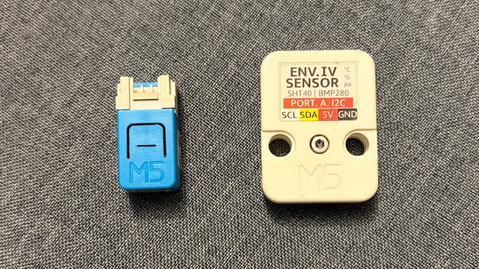

---   
title: "A simple smart DIY AC controller to cut power bills"
description: "A simple ESP32-based controller that turns your AC on/off based on room temperature - saving electricity without apps, cloud, or complexity."
thumbnail: "a-simple-smart-diy-ac-controller-to-cut-power-bills.jpg"
icon: "a-simple-smart-diy-ac-controller-to-cut-power-bills-icon.png"
tags: 
 - home
 - tech
 - m5stack
 - diy
 - arduino
 - esp32
date: 2026-04-21
---

The temperature in my place is around 38°C during the daytime, and the AC in my room is running almost all the time.

In the last couple of months, I started noticing something. My electricity bill was quietly going up. Not dramatically, just enough to make me uncomfortable.
See: [How I track and predict electricity consumption at home](/blog/how-i-track-and-predict-electricity-consumption-at-home/)

I usually set my AC to 26°C, expecting it would maintain that temperature efficiently. But that’s not how it works. Even when the room becomes cooler than 26°C, the AC doesn’t really “turn off”.

It just keeps running. The compressor keeps working. Power keeps getting consumed. Basically, my AC had no idea when to stop even though it has a sensor inbuilt.

## The Idea

What if I could sense the temperature using an external device and turn the AC on/off only when needed?

Meaning:

- Monitor room temperature
- Turn OFF when it’s cool
- Turn ON when it gets hot again

That’s it. Nothing fancy.

## The Setup

I used:

- [M5Stack Nano C6](https://shop.m5stack.com/products/m5stack-nanoc6-dev-kit) (An ESP32-C6FH4 SoC with built-in IR and RGB LED)
- [M5 Stack ENV IV unit](https://shop.m5stack.com/products/env-iv-unit-with-temperature-humidity-air-pressure-sensor-sht40-bmp280?variant=44010397106433) (An environmental sensor unit embedded with SHT40 and BMP280 sensors for measuring temperature, humidity, and atmospheric pressure data)

No cloud. No app. No overengineering.

M5Stack makes prototyping easy. No soldering required, and plenty of sensors and controllers to choose from.

## How AC Remote Works

AC remotes don’t work like TV remotes. They don’t send:

- Increase fan speed
- Decrease temp

Instead, they send the **entire state**:

- Mode (cool/dry)
- Temperature
- Fan speed
- Timer
- Swing

Everything. In one shot.

So I captured the IR signal from my remote using an IR receiver, stored that signal in my code so that i can replay that using Nano C6. Now I can reliably control my AC.

## The Logic

The controller checks the temperature every few minutes:

- If the room is *hot → turn AC ON* (send IR signal)
- If the room is *cool → turn AC OFF* (send IR signal)

That’s it.

## A Small Safety Net

I didn’t want the AC running forever if my device fails.

So every time I send the **ON signal**, I also include a **30-minute timer**.
Even if my microcontroller dies, the AC will turn off automatically.

## Some UX for the Controller

The controller has a built-in RGB LED. I used it to show the temperature:

- 🔴 Red → Hot
- 🟢 Green → Ideal Temperature
- 🔵 Blue → Cool

Now I don’t need an app or display to understand the current temperature of the room.

Since the room is closed, it stays cool for a while even after turning off.
All of this is handled by a tiny device sitting quietly in the corner, saving me on power bills.

Here is the [source code for Smart AC Thermostat](https://github.com/shajanjp/smart-ac-thermostat) if you want to have a look or use the same.
