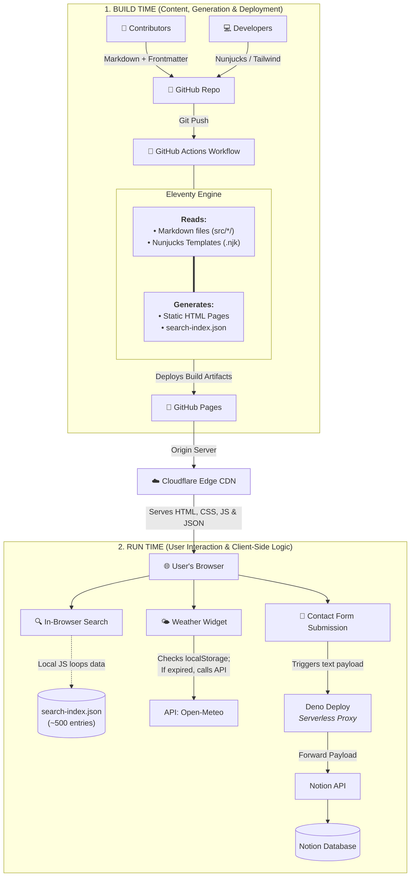
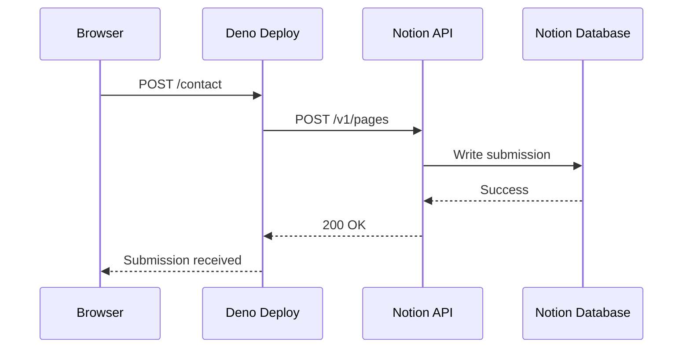

## Why I Built It

Information about Piravom is scattered across Google Maps, Facebook pages, WhatsApp groups, business listings, and personal contacts. There wasn't a single place where residents and visitors could easily discover local businesses, attractions, services, events, and useful phone numbers.

I wanted to create a central hub for the town that would be:

* Fast
* Easy to maintain
* Search engine friendly
* Cost effective
* Accessible to non-technical contributors

What started as a local directory eventually became an interesting experiment in static-first web architecture.

## The Principles Behind the Architecture

Before writing a single line of code, I defined three architectural principles that would guide the entire project.

### 1. Keep the Infrastructure Simple

The portal contains restaurants, shops, services, attractions, events, and phone book entries. Even as the project grows, I expect the total amount of content to remain well under 2,000 records. For a dataset of this size, provisioning and maintaining a database felt unnecessary. Instead, I decided to treat the filesystem as the database. Every listing is stored as a Markdown file with frontmatter metadata.

```markdown
---
title: ABC Bakery
category: Shop
phone: 9876543210
address: Piravom
---

ABC Bakery Data - with categories, phone numbers, and addresses.
```

The content repository is organized into folders such as:

```text
src/
├── restaurants/
├── shops/
├── services/
├── attractions/
├── faq/
├── blog/
└── events/
```

This approach keeps the data human-readable, version-controlled, portable, and easy to maintain.

### 2. Optimize for Speed

The portal is primarily a content website. Users are reading information rather than performing transactions.

Instead of generating pages dynamically for every request, all pages are generated ahead of time during the build process. Visitors receive pre-built HTML files directly from the CDN.

This eliminates:

* Database queries
* Backend rendering
* Runtime page generation

The result is a faster website with fewer moving parts.

### 3. Make Contributions Easy

Another important goal was enabling non-technical contributors to participate. I wanted my wife, who does not come from a software development background, to be able to add or edit content without learning databases, deployment pipelines, or administration panels. Because everything is stored as Markdown files, contributors can use familiar tools such as:

* [Obsidian](https://obsidian.md/)
* Any text editor or markdown editor

Adding a new business is often as simple as creating a file and filling in a few fields. This decision significantly improved the long-term maintainability of the project.

### Architecture Diagram




## Why Eleventy?

The website is built using [Eleventy (11ty)](https://www.11ty.dev/), a static site generator that converts Markdown and template files into a complete static website.

The project uses:

* [Markdown](https://daringfireball.net/projects/markdown/) for content
* [Nunjucks](https://mozilla.github.io/nunjucks/) (.njk) for templates
* [Tailwind CSS](https://tailwindcss.com/) for styling

During the build process, Eleventy generates a dedicated HTML page for every listing.

This provides excellent performance and search engine visibility while keeping the development workflow simple.

## Search Without a Search Engine

One common question is: "How does search work without a database?"

The answer is that search runs entirely in the browser.

During the build process, a [JSON](https://www.json.org/) file containing searchable content is generated. The current search index contains roughly 500 entries.

When a visitor performs a search:

1. The JSON data is loaded in the browser.
2. Custom JavaScript filtering is performed locally.
3. Results appear instantly.

With a relatively small dataset, client-side filtering is both simpler and faster than introducing a dedicated search service.

## Weather Widget Optimization

The weather widget is one of the few features that relies on external data.

Weather information is fetched from the free [Open-Meteo API](https://api.open-meteo.com/). Since the portal focuses specifically on Piravom, the location is hardcoded rather than relying on browser geolocation.

To reduce API usage, weather responses are cached in the browser's [localStorage](https://developer.mozilla.org/en-US/docs/Web/API/Window/localStorage) and reused for the remainder of the day.

This keeps the widget responsive while avoiding unnecessary API requests.

## The Only Dynamic Component

The website is almost entirely static.

The only dynamic feature is the contact form.

The request flow looks like this:



When a visitor submits the form, the browser sends data to a small API hosted on [Deno Deploy](https://deno.com/deploy). The API then writes the submission into a [Notion](https://www.notion.so/) database.

This gives me a simple way to collect feedback without maintaining a traditional backend application or database.

## Deployment Pipeline

Deployment is fully automated.

Every push to [GitHub](https://github.com/) triggers a [GitHub Actions](https://github.com/features/actions) workflow that builds the website and publishes it to [GitHub Pages](https://pages.github.com/).


Once deployed, traffic is routed through [Cloudflare](https://www.cloudflare.com/), which provides:

* Global CDN caching
* SSL certificates
* Faster content delivery
* Additional reliability

The combination of GitHub Pages and Cloudflare provides a surprisingly powerful hosting setup at virtually no cost.

## SEO and Discoverability

A major advantage of static site generation is that every listing becomes a dedicated webpage.

Examples include:

```text
/restaurants/abc-bakery/
/services/pqr-bike-workshop/
/attractions/xyz-hill-view-point/
```

This allows search engines to index each listing independently.

To improve discoverability, I also invested time in:

* [Schema.org](https://schema.org/) structured data
* [Open Graph](https://ogp.me/) metadata
* Semantic HTML
* General SEO best practices

The goal was to make the content easily discoverable by both traditional search engines and modern AI-powered discovery systems.

## Future-Proof Content

One unexpected benefit of storing content as files is that it remains easy to work with outside the website itself.

Because the entire dataset exists as Markdown files:

* Humans can read it
* Developers can version-control it
* AI agents can process it
* Content can be migrated easily in the future

The site also includes an [`llms.txt`](https://llmstxt.org/) file to make it easier for language models and AI assistants to discover and understand the content.

By treating content as files rather than records hidden behind a database, the project remains portable and future-friendly.

## Performance

Because pages are generated during build time and served through Cloudflare, the site consistently achieves excellent [Lighthouse](https://developer.chrome.com/docs/lighthouse/) scores while requiring almost no runtime infrastructure.

Most requests are served directly from static files, making the browsing experience fast and predictable.

## Lessons Learned

This project reinforced an idea that many developers overlook:

- Not every website needs a database.
- Not every website needs a backend.
- Not every website needs cloud infrastructure.

For content-driven websites with a relatively small dataset, a static-first architecture can provide:

* Better performance
* Lower costs
* Easier maintenance
* Simpler deployments
* Greater content ownership

In many cases, files can be a perfectly valid database.

## Final Thoughts

Piravom Portal started as a simple directory for my hometown, but it also became an experiment in how far a static-first architecture can go.

By treating files as the source of truth, I was able to build a fast, searchable, SEO-friendly platform that costs virtually nothing to host and remains easy for anyone-even non-developers-to maintain.

For a project with fewer than a few thousand records, simplicity turned out to be the most scalable decision.
