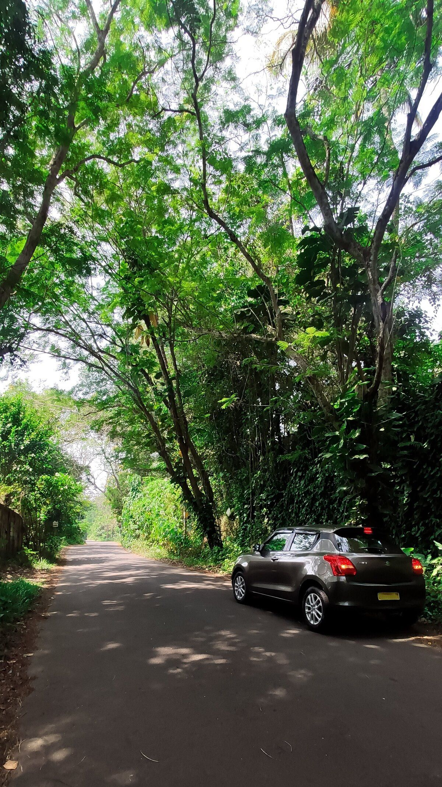
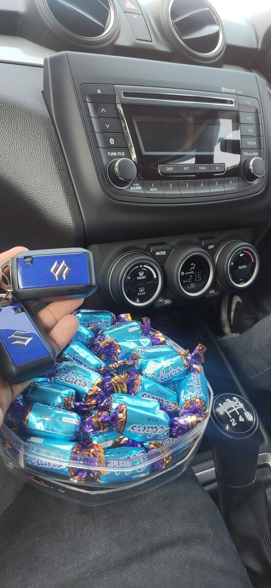
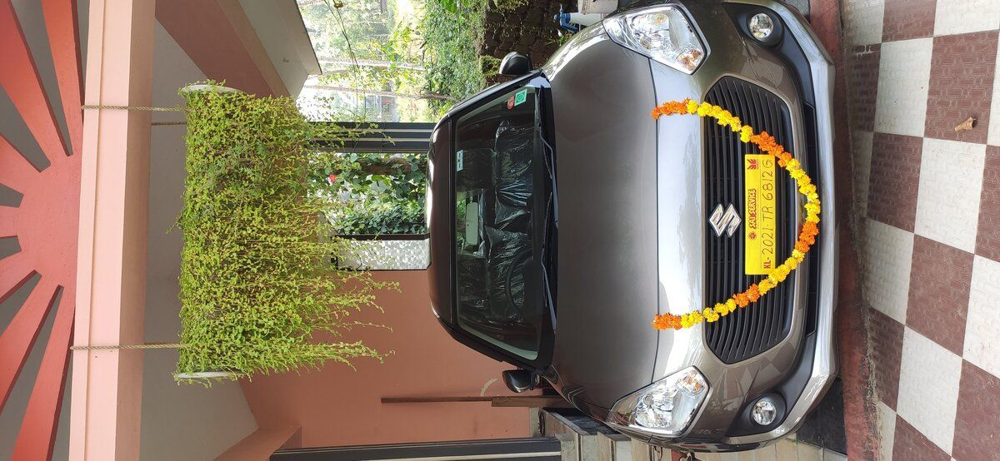
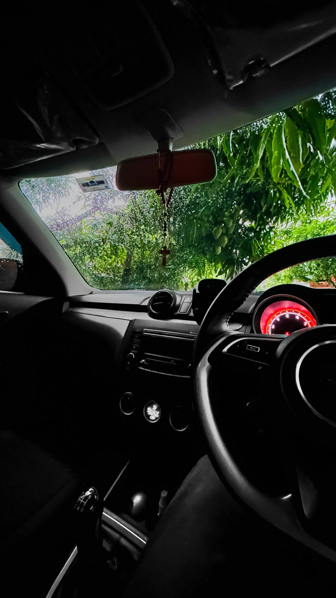
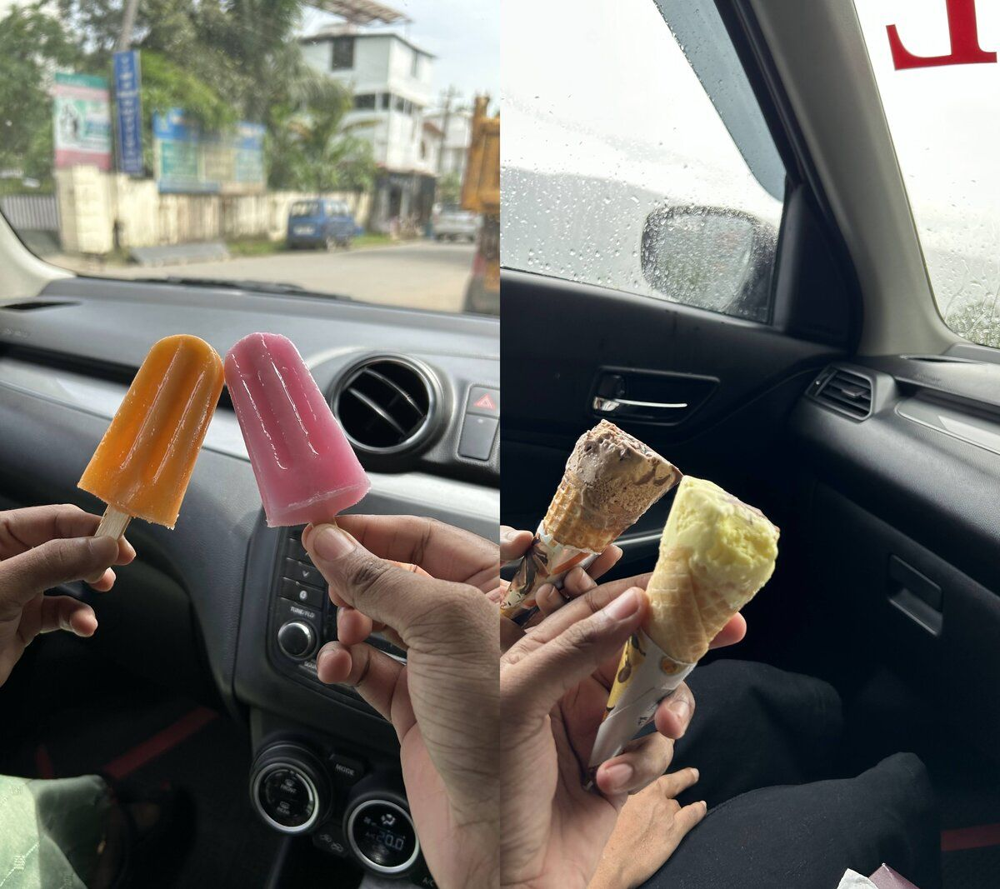
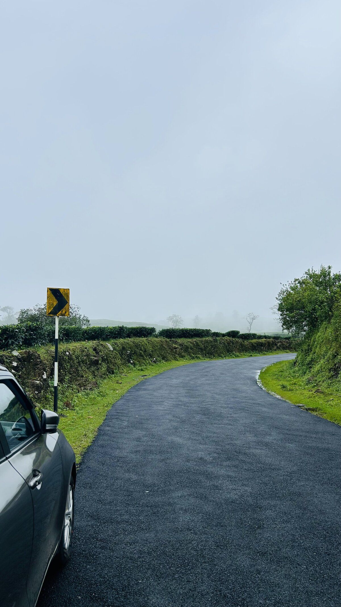

## A Car I Never Planned to Buy

Owning a car is almost everyone's dream, but it wasn't the same for me. A car was never on my checklist. During the COVID lockdown days, when public transport was completely shut down, I started to think the situation might last forever. It was then that I considered buying a car so my family could have a way to travel when needed. But here's the catch - I had never driven a car before, and to be honest, I wasn't really interested in driving either.

Initially, I thought I'd learn to drive in my friend's car before buying my own. But later, I decided it might be better to buy a car and learn to drive in it directly. The Maruti Swift was a model that caught my eye. I knew it wasn't known for its build quality, but I had many friends who had owned a Swift for years and still spoke highly of it.

Within a month, I managed to arrange some money and booked the Swift. The delivery was delayed by two weeks. On the day of delivery, I went with my friend to pick up the car from the showroom since I didn't know how to drive yet. Since we both had free time during weekends, we decided to practice driving together. We chose a place near my home called Velloor, a spot with minimal traffic that made it ideal for beginners like me.

At first, I got used to steering and controlling the car, but gear shifting and managing the clutch at slow speeds were challenging. We continued our weekend practice sessions for the next two to three months, but progress was slow. I still couldn't drive on my own and always needed someone in the passenger seat to guide me. My house is on a steep road with a tricky 90-degree turn needed to park the car in my porch, which made it even harder for me to build up the confidence to drive alone.

## Learning the Hard Way

A few months later, my friend Prince had to move abroad for his higher studies. Around the same time, I got married. This left me in an awkward situation: my wife and I had to rely on my scooter for travel, even though we had a car parked right there. Fortunately, another friend, Anandu, stepped in to help me with my driving lessons.

Anandu had a different approach to teaching. If I got stuck in traffic or showed any reluctance to drive, he wouldn't take over the wheel. He made me handle every situation myself, believing that was the best way for me to learn. His teaching style, though tough, turned out to be exactly what I needed. He also shared simple yet effective tips to improve my driving skills. One of the most valuable pieces of advice was learning how to judge the car's size and the space on either side using the lines on the road. Gradually, I gained more confidence and felt better control over the car. I felt confident while he sat in the passenger seat. Yet, the fear of driving alone still lingered.

As time passed, people around me started questioning why I even bothered to buy a car if I wasn't planning to drive it. The pressure to learn driving became intense, and it was frustrating to always depend on someone else whenever we needed to use the car. After about six months of setbacks, my wife and I decided it was time to start over and try learning again.

## Gaining Confidence

We woke up early in the morning and took the car out of my house, then practiced putting it back in reverse. This was the hardest part for me and the thing that scared me the most. After doing that for a few days, I became confident enough to take the car out on my own.

After a few weeks, I decided to drive to my wife's house, which is 25 km away from my home. We took the car very early in the morning when there was hardly any traffic. We managed to drive all the way, and my wife helped me by keeping an eye on things around us. She was very supportive and happy that I had learned to drive.

Later, we started going to nearby places where there was less traffic. By that time, I was confident enough. Then one day, Anandu came up with a plan for a trip to Munnar, and he wanted me to drive all the way there. Munnar is actually around 100 km away from my house. Since we started late at night, there wasn't much traffic, and I drove the entire journey, which made me even more confident.

## 50,000 Kilometers Later

    
Recently, I completed around 50,000 km in the car. Looking back at how I learned to drive, I feel happy and thankful to everyone who helped me throughout this journey. This car has given me many opportunities to travel with my family and friends and has become a part of our lives.
