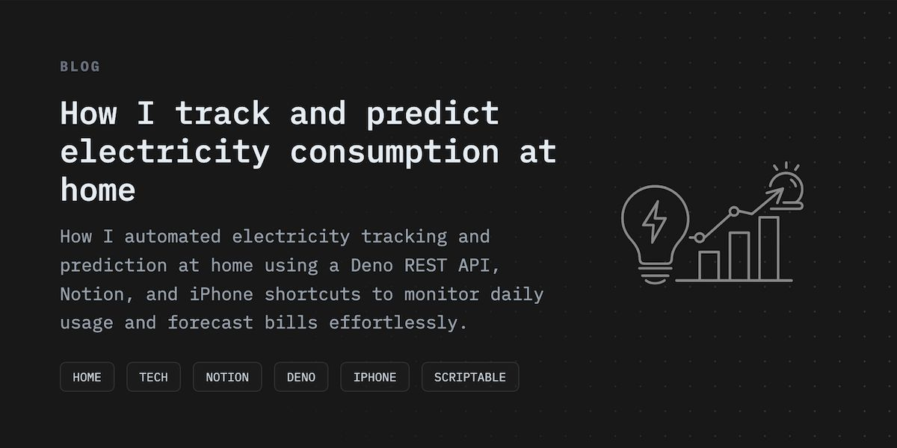
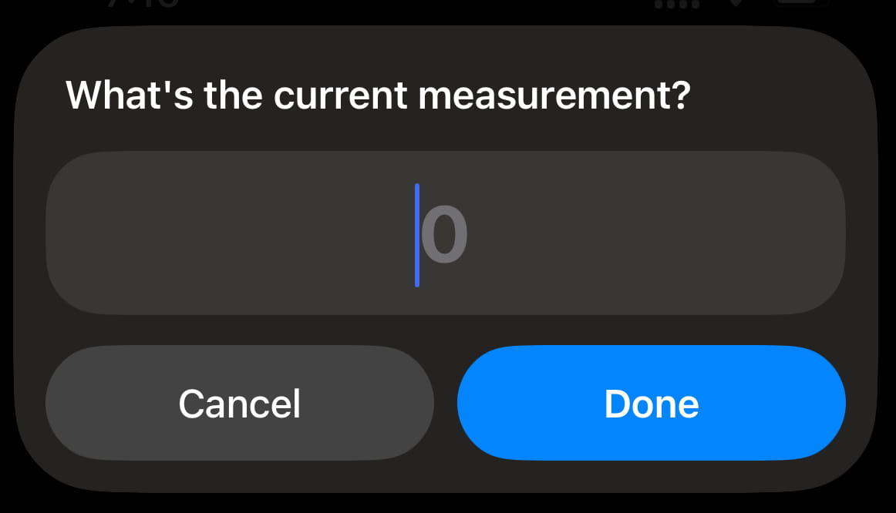

---   
title: "How I track and predict electricity consumption at home"
description: "How I automated electricity tracking and prediction at home using a Deno REST API, Notion, and iPhone shortcuts to monitor daily usage and forecast bills effortlessly."
tags: 
 - life
 - home
 - tech
 - monitor
 - notion
 - deno
 - iphone
 - scriptable
date: 2024-10-05
---

## TLDR

After receiving an unexpectedly high electricity bill, I built a system to track and predict my electricity consumption using a [Deno](https://deno.com/) REST API thats connected to a [Notion](https://www.notion.so) database. It calculates daily usage, current costs using the KSEB API, and future bill predictions. I log my meter readings via an [iPhone Shortcut](https://support.apple.com/en-in/guide/shortcuts/welcome/ios), and an iOS widget created with [Scriptable](https://scriptable.app/) displays the data on my phone home screen.

## The bill that started it all

About six months ago, I received an electricity bill that was almost three times higher than what I usually pay. This unexpected spike made me take a closer look at my electricity usage to figure out what had gone wrong and how I could prevent it from happening again.

I used [KSEB’s official electricity bill calculator](https://bills.kseb.in/) to understand the billing structure. Here’s a brief breakdown of the slabs and rates for those unfamiliar:

- For usage below 500 units:
  - ₹3.25 per unit for the first 100 units
  - ₹4.05 per unit for the next 100 units
  - ₹5.10, ₹6.95, and ₹8.20 for higher slabs
- If consumption falls between 500 and 600 units, the rate is ₹6.40 per unit.
- Between 600 and 700 units, it increases to ₹7.25 for the lower slab and ₹7.60 for the higher one.

That month, I had consumed nearly 600 units, which explained the steep bill. To ensure this didn’t happen again, I decided to track my power usage on a daily basis.

## Meter reading tracking

The digital electricity meter in my home shows various details, including voltage, frequency, and meter readings. Since I use Notion as my personal organization tool, I thought it would be convenient to store and monitor my electricity data also there.

I built a Deno REST API server to handle the tracking. It has two main endpoints:

•	**POST /electricity:**

This API calculates the average daily electricity consumption and the current bill amount using the KSEB API, then logs the data in my Notion database.

•	**GET /electricity/summary:**

This API retrieves a summary that includes my average daily electricity consumption, the current meter reading, total bill amount for the units consumed so far, and a predicted final bill. The prediction is based on the average daily consumption multiplied by the number of days in the billing cycle (60 days).

## Automation & Analysis

To make the logging process easier, I created a Shortcut on my iPhone. Every time I enter the current meter reading, the shortcut automatically sends the data to the **POST API**, logging it in Notion.

For quick access to the data, I also built an iOS widget using the Scriptable app. This widget pulls data from the summary API and displays key information like:

- The total units consumed so far
- The current bill amount
- A predicted final bill
- Average daily consumption

This setup allows me to effortlessly track my electricity consumption, with the data visible at a glance on my phone. By doing this regularly, I have a better understanding of my electricity usage and can keep a closer eye on how much I’m likely to be charged.

## So, thats it

By tracking my electricity consumption daily, I’ve managed to stay on top of my usage and avoid unexpected spikes in my bill. The combination of Notion, the Deno REST API, and iPhone automation has made the process efficient and seamless.

If you’ve ever been surprised by a high electricity bill, setting up a similar system could help you gain better control over your electricity consumption. If you are lazy, atleast write down the meter readings in a book once in a while and analyse it.

I know there are other smarter methods to track this, like a Wi-Fi connected electricity meter, etc., but this is the easiest and cheapest way I found to solve the issue.

## Whats Next

With a clear understanding of my daily power usage, I’m planning to reduce consumption by replacing all old fans with energy-efficient BLDC models. Additionally, I’m exploring solar power to support some of my energy needs.