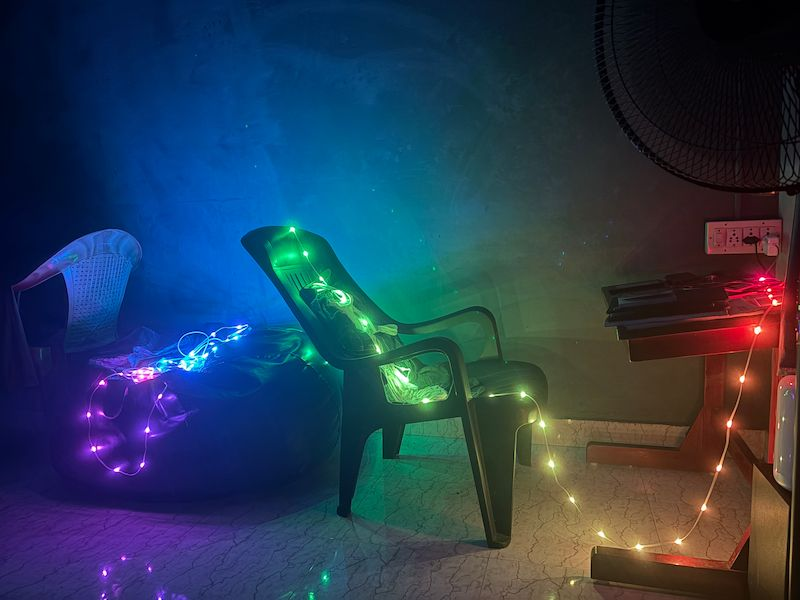

I've always been obsessed with lighting - I've written about it on my blog, including [Merry Pixels: A Hand-Crafted Programmable Christmas Star](https://shajanjacob.com/blog/merry-pixels-a-hand-crafted-programmable-christmas-star/) and [The Story of a Light Bulb](https://shajanjacob.com/blog/the-story-of-a-light-bulb/) - and NeoPixels are truly a great technology for anyone who loves lighting.

See the project here: [Pixels String](https://shajanjacob.com/projects/pixels-string)

## It started with a very simple mood light idea

The hardware is simple. I used an M5Stack NanoC6 (ESP32-C6) connected to about 90 NeoPixels.

At first, the idea was to create a firefly-like effect using these 90 LEDs to make a nice ambient light. It looks superb at night, but when you're doing something on your laptop or reading, it's not that useful. So I added more animations, which can be changed by pressing the button on the controller. Eventually, it turned into over 25 effects.

There’s a Twinkling Stars mode, a Fireflies mode, a slow Heartbeat, and a Pixel Runner that moves across the strip.

Everything runs directly on the ESP32. No external rendering, no streaming. I just need to press the button on the controller, and the light effect changes.

  <iframe width="315" height="560" src="https://www.youtube.com/embed/WrpV2bcmpqo" title="YouTube video player" frameborder="0"></iframe>

## Then I gave it an API

To change the animation, I had to manually press the button each time. Walking to the controller every time I changed the effect became irritating. So, to make it more accessible, I first exposed a few capabilities through REST APIs. I added the following:

- GET /api/effect?name=<name> - Sets an animation. (eg: AURORA | FIREFLY | HEARTBEAT etc)
- GET /api/variation?index=<0-4> - Set the variation of the current effect.
- GET /api/power?state=<on|off> - Turn LEDs on or off.
- GET /api/brightness?value=<0-255> - Set the global LED brightness. Applied to every effect and pattern, and saved to NVS (non-volatile storage) so it persists across reboots. 0 turns the LEDs off, 255 is maximum. Read the current value from /api/info.
- GET /api/pixels/set - Set pixel colors with customizable patterns. All parameters are passed as query strings.
- GET /api/info - Returns a JSON object with the current state.

It can switch animations, change brightness, set colors, and control how much of the strip is active. At that point, anything that can make an HTTP request can control the light. And that completely changed how I used it.

  <iframe width="315" height="560" src="https://www.youtube.com/embed/nBVhZI97OY4" title="YouTube video player" frameborder="0"></iframe>

## Web UI for mobile and desktop

    
I also added a simple web UI. No backend, no cloud, no extra server. The ESP32 serves everything (HTML, CSS and JS) directly from flash memory. This web page internally calls the REST APIs I created before to control the light.

It supports mDNS too, so I don't even need to remember the IP address. Settings like Wi-Fi, brightness, and animation state are saved, so it survives reboots. It became a fully self-contained, internet-connected (LAN) light.

## A few useful automations

Once something has an HTTP interface, it becomes easy to automate.

Apple Shortcuts can call the API directly, so I can link lighting to whatever I’m doing. Open Spotify and the room turns green. Open a movie/video app and the lights dim. Switch apps and the colors shift.

The apps don't need to know the light exists. Shortcuts is just the glue between them.

### Arrive Home → Change the Room Mood Light

When my phone connects to Wi-Fi, an automation runs and the light turns on with my usual evening color.

No hub, no ecosystem. Just an event triggering an HTTP request.

### NFC Tag by the Bed

I also stuck an NFC tag near my bed. A tap on it switches the room to a warm, low-brightness mode. Another NFC tag I placed near my table triggers a bright yellow light, good for reading and for when I'm using a computer.

It’s basically a physical shortcut button for lighting.

## Then I gave it a pinch of AI support

I added an MCP server in the Arduino program so AI agents can control the light. Now I can just say "set the room to purple" and it actually happens.

## Browser Controlled

I also made a Firefox extension that reads the theme color of the current tab and sends it to the light. So the room subtly follows what I'm browsing. Switch tabs, and the lighting changes.

Pinterest -> Red
LinkedIn -> Blue
Spotify -> Green

No special integration needed - just a plugin that extracts the color from metadata or the favicon, then invokes the same REST API.

## The point of all this

Did it need REST APIs? No. Did it need MCP? Definitely not. But that's the point.

The LEDs are the visual part, but the API is the real project. The hardware is simple. The system is simple. Yet once your room mood light becomes programmable, it stops being just a smart light. Anything can control it - phone, browser, scripts, NFC tags, AI agents - and none of them need to know the device exists. They just speak HTTP.

That's what made it interesting. It started as ESP32 → LEDs, and slowly became anything → API → the room.

Not because it had to, but because it was fun to see how far it could go.

Once your room's lighting has an API, ideas come easily. You could turn it red on failed builds, show weather through color, indicate focus or availability, react to music, show notifications, or reflect calendar status.

Or you can just run a calm animation and ignore all of that.
