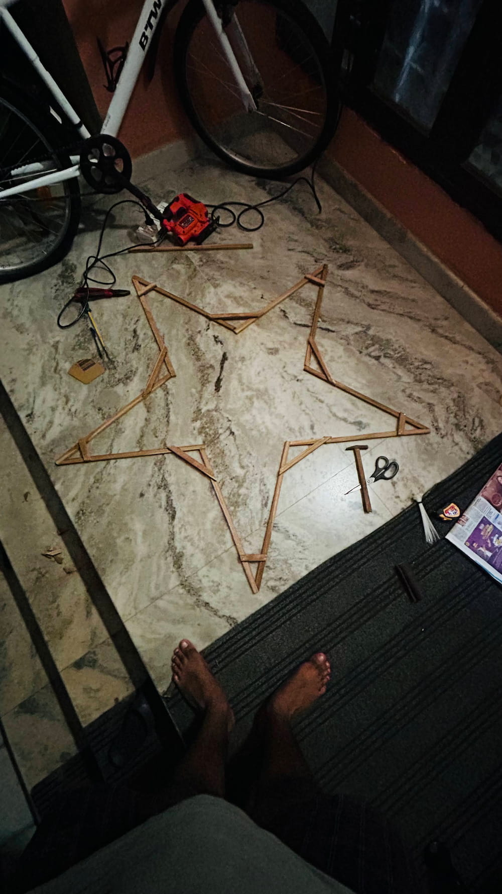
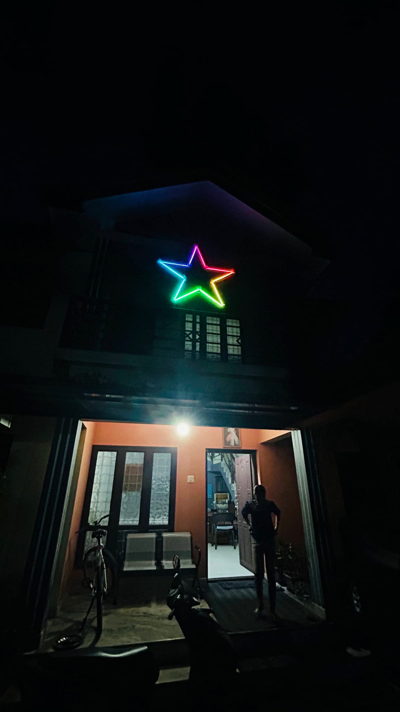

---   
title: "Merry Pixels: Hand crafted programmable christmas star"
description: "A hand crafted christmas star thats programmable using javascript by anyone around the world"
tags: 
 - christmas
 - home
 - tech
 - ws2812b
 - deno
 - esp32
 - arduino
date: 2024-12-23
---

## TLDR:
I created a christmas star with 300 led bulbs and hung it in front of my house, which can be programmed by anyone around the world the way they want. Give it a [try here](https://merry-pixels.deno.dev/).

## Backstory:
Like a lot of other people, I like the December season very much. The holidays, snow weather, lights, gifts, and Christmas cake. The time spent on decorating the house with lights and making the Christmas crib always gives a warm feeling. This season brings back good childhood memories too. Colorful lights blinking everywhere always make me happy. I’ve written a few lines on how obsessed I am with lights [here](https://shajanjacob.com/blog/2022/07/16/the-story-of-a-light-bulb.html). 

Nowadays there are a lot of Christmas stars available in the market. Everyone is buying them, and almost all the stars in the neighborhood look the same, which is boring. Me, together with my wife, wanted to make a star handcrafted from locally available materials and hang it in front of the house, which would be special compared to what others have.

## The Journey: From Idea to Reality



We started with creating the frame for the star using teak wood, which we bought from the local wood store. Angles and measurements were taken precisely so that the 5 sides of the star would have the same shape. We cut the wood and attached them with wood glue and iron nails. Each side of the star leg is 50 cm in length, and the entire perimeter of the star is thus 300 cm. Once the wood frame was ready, we tied the diffuser light panel to the frame using wire ties.

For the lighting, I decided to go with the addressable RGB LED strip I had in my stock. The LED strip I had was also 5 meters in length, which means each side of the star leg will get 30 LEDs. Perfect.


I cut the strip into 10 pieces, each 50 cm long, and my wife stuck the LED strips to the panel easily. We soldered the LED strips together and made sure they were working fine. I hung it in the room for the first couple of days and tried some animations before hanging it in front of my house.

I chose to use the ESP32 as the controller to drive the LEDs. I had an M5Stack Atom S3 in my stock, so I took that one for this project. I created a web server using Deno with a couple of REST APIs to accept and provide the animation data to the star. The ESP32 controller is connected to Wi-Fi and is listening to the Deno server to get the star animation data.


I also created a [web page that has an emulator of the star](https://merry-pixels.deno.dev/) using HTML canvas with the same number of lights and the same shape as the physical star. I also added a code editor to the web page, which can be used to program the star. The editor has a boilerplate JavaScript function called twinkle() which can be programmed to return a string that includes the colors for each LED in the star and a delay value that will decide how much time that particular color should stay lit.

Each leg of the star has 60 LEDs (30 LEDs on each side), which makes 300 LEDs in total for the star. To animate it, we need 300 colors to be there in a single frame (colors of the star at a given moment). Also, for creating an animation (for example: to make an LED run from start to end), we need 300 frames. I decided to take the color input in hexadecimal colors.

```markdown
F00-0F0-00F:1000  
000-000-000-F00-0F0-00F:1000  
```

The above format is the expected output from the twinkle function. Each line represents a frame. In each frame, the color for each LED is represented by hexadecimal values, and LEDs are delimited with hyphens. The last numerical part decides the delay value. With this sample animation data given above, the first LED will be set as red, the second green, and the third as blue, and then stay that way for 1 second. Then the 4th LED is set to red, the 5th LED to green, and the 6th LED to blue and kept for 1 second.

Using this idea, any animation can be created.

<iframe width="315" height="560" src="https://www.youtube.com/embed/NqWbfRxFq-4" title="YouTube video player" frameborder="0"></iframe>

## Challenges:

### 1.	Powering the LEDs
The RGB LED strip used is the WS2812b model, and it consumes 60mA of power when red, blue, and green are lit at full brightness. This means 60mA × 300 = 18A is the power needed for this project. I was initially using a 4A mobile phone charger, and I had issues when lighting all the LEDs at the same time. Later, I bought a 5V 20A power adapter to solve this.

### 2.	Emulator
Programming the Arduino each time and then uploading it to the ESP32 controller was a hectic process. So, I decided to create a web page with a star emulator and an editor that can be used to program the LEDs. This introduced many challenges, like handling the data and processing it in the controller.

### 3. APIs for Getting the Animation Data
I initially created a REST API that returned all the 300 frames as JSON, but the size was too large for the ESP32 to parse and process. 300 hex colors × 300 frames + JSON encoding characters made it around 1.5 MB for a single animation. Microcontrollers usually have very limited RAM and are not efficient at processing data like this.
Even though I reduced the 6-character color (eg FF0000) to a 3-character hex color string (eg: F00), it didn’t help much.

I decided to get rid of the JSON format and use plain text input instead. Also, instead of returning all the frames at once, I made changes in the Deno server to make the response a stream. I updated the ESP32 to handle the stream and process the colors, which resolved the issue.

## Why and What’s Next:
Like every other hobby project, I started this as a weekend fun activity. This taught me so many things, like powering so many LEDs, streaming API responses, and creating each animation like solving an algorithm problem. I enjoyed spending time with my wife making the star together.

Anyone can contribute animations. I will be running all the animations together and posting a video showing all the submissions in one go.

Thanks, everyone. Merry Christmas! 🎄

