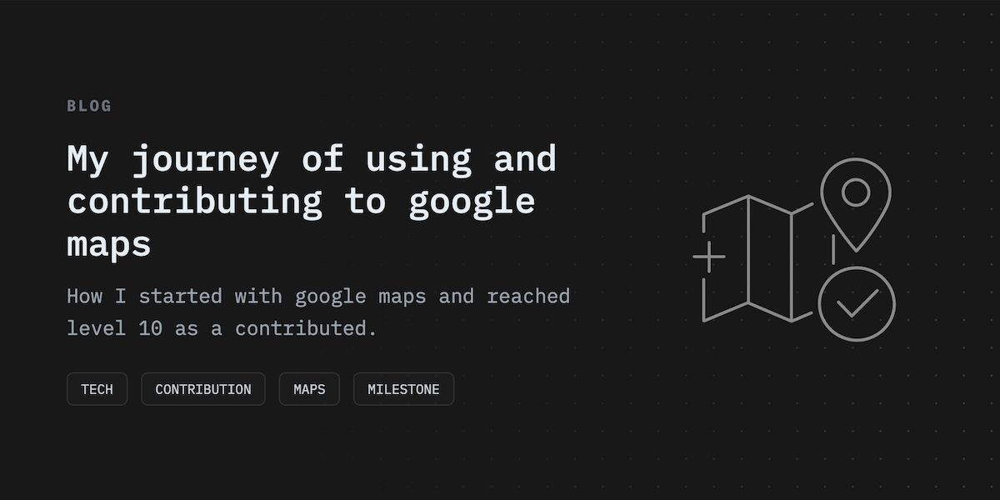

## My perspective on maps

The map is a spectacular invention, without any doubt. Plotting and understanding the planet we live in to a single image is a tremendous achievement. Every time I zoom out on the map, I realize how tiny I am and my surroundings. Seeing photos of places around the world without physically going there is a luxury. I’ve not traveled to any places outside of my country. I've not even visited 1% of the places in the country I’m living-in, still, I can imagine how certain places look like, or how to navigate to places. I also like the idea of knowing and letting others know about places.

## How I use Google Maps

I primarily use maps to locate and navigate places. I also read reviews about the places before visiting. Using google maps, it is easy to make a list of places to visit when you are going to a new city. I also use live location sharing which makes it handy to know and let others know our real-time location.

## Google Maps pointing system

Google maps is a community-driven navigation application. People can use it to locate places, plan travels, read/write reviews and add or edit missing roads and places. Every contribution is counted towards the google maps reward points. Depending upon the reward points you earn, you will be placed in one of 1-10 levels.

## How I started

I started contributing to google maps 10 years ago (2012). My first contribution was adding a local shop near my house. I used to take maps and see surrounding places whenever I visit new places and when I’m bored.

## Contributions

In the last couple of years, I’ve added lots of photos to locations and reviewed many places. Even though I’ve added so many missing roads and places, I contributed more to removing the clutter from maps, like removing non-publicly accessible places like houses. I’ve also contributed to translating places to the local language.

It took me 4 years to reach level 10 from level 6.

## Benefits

There's not much to expect. Google doesn’t pay anything for any contribution. But gives away freebies like google drive storage space or free/trial subscriptions to their services depending on which level you belong.

## What's next

I just love to read what people tell about places. I may continue contributing whenever I’m free.