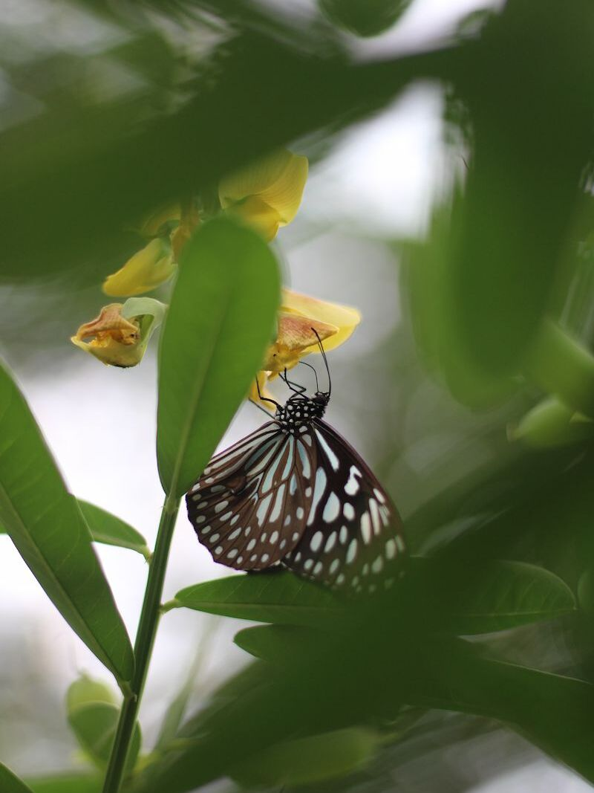
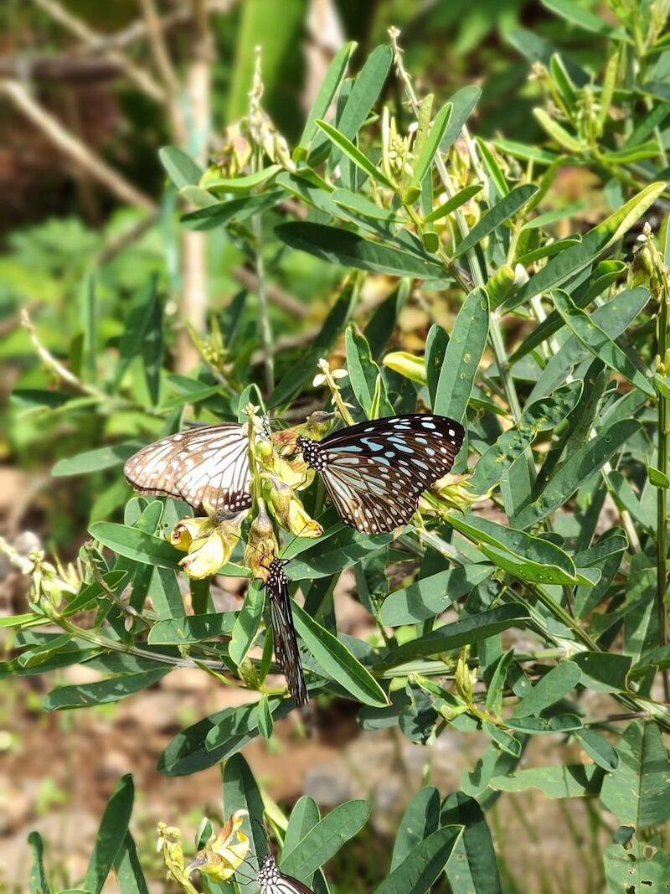
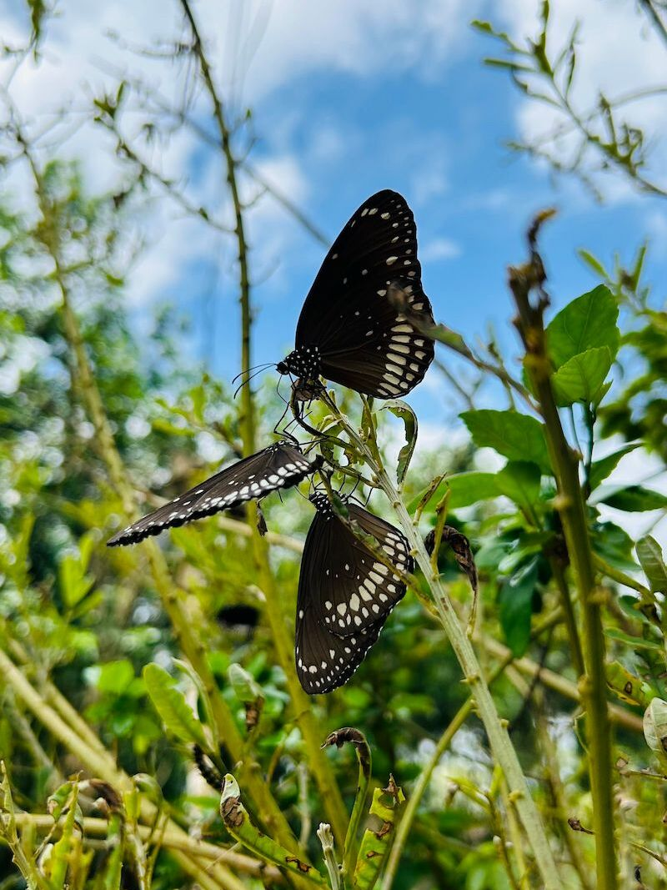
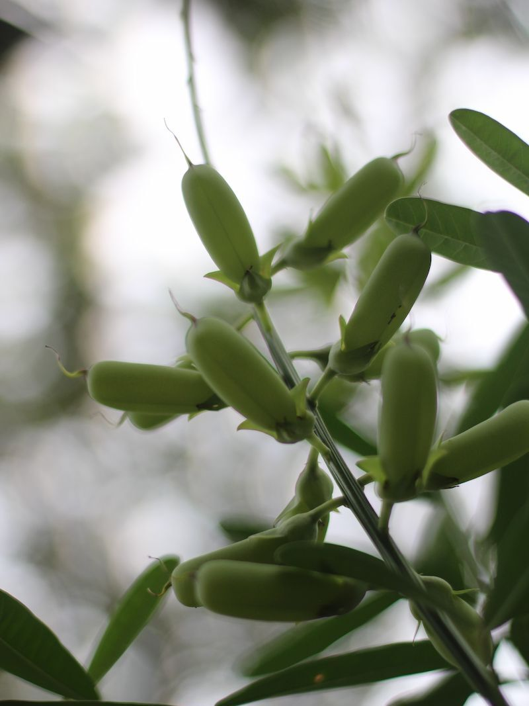

## About the Plant

Rattleweed (*Crotalaria* species) is a wild flowering plant commonly found along roadsides, open fields, and grasslands. It produces clusters of cheerful yellow flowers that bloom for several weeks. Once the flowers dry, they form seed pods that make a rattling sound when shaken, which is where the plant gets its common name.

It grows quickly, needs very little care, and does well in sunny places.

## Where Did I Find It?

A few years ago, I visited a hill near my place called Illikkal Kallu. On the way, I noticed a few plants in front of a roadside house. There were about four plants, and they were completely surrounded by hundreds of butterflies. It was a beautiful sight, and I couldn’t help but feel curious.

I stopped and spoke to the house owner, who told me about the plant. He was kind enough to offer me a few seeds, which I later brought home and planted in my garden.

## Why Do Butterflies Love It?

The leaves of this plant are what really attract butterflies. They often land on them and draw out the juices, which seems to be an important part of their feeding behavior.

## What Butterflies Visit It?

In my garden, I regularly see:

* Blue Tiger
* Plain Tiger
* Small yellow butterflies (like Grass Yellows)

Occasionally, a few other small butterflies also visit the plant.

The exact visitors may vary depending on where you live, but if butterflies are around, there's a good chance they'll find this plant.

## How to Plant It

Growing rattleweed is surprisingly easy.

* Collect mature, dry seed pods.
* Remove the seeds and sow them directly in loose soil.
* Choose a sunny location.
* Water lightly until the seedlings establish themselves.
* After that, the plant needs very little attention.

It grows quite fast and usually starts flowering within a few months.

## Where to Get the Seeds

If you live in an area where rattleweed grows naturally, the easiest way is to collect a few mature seed pods from wild plants. The dry pods are easy to spot because they turn brown and rattle when shaken.

You may also find seeds from native plant nurseries or online sellers that specialize in butterfly-friendly plants.

If you have a little space in your garden, I highly recommend giving this plant a try. It asks for very little in return but rewards you with a constant stream of butterflies. Watching them flutter around the yellow flowers has become one of my favorite parts of spending time in the garden.
