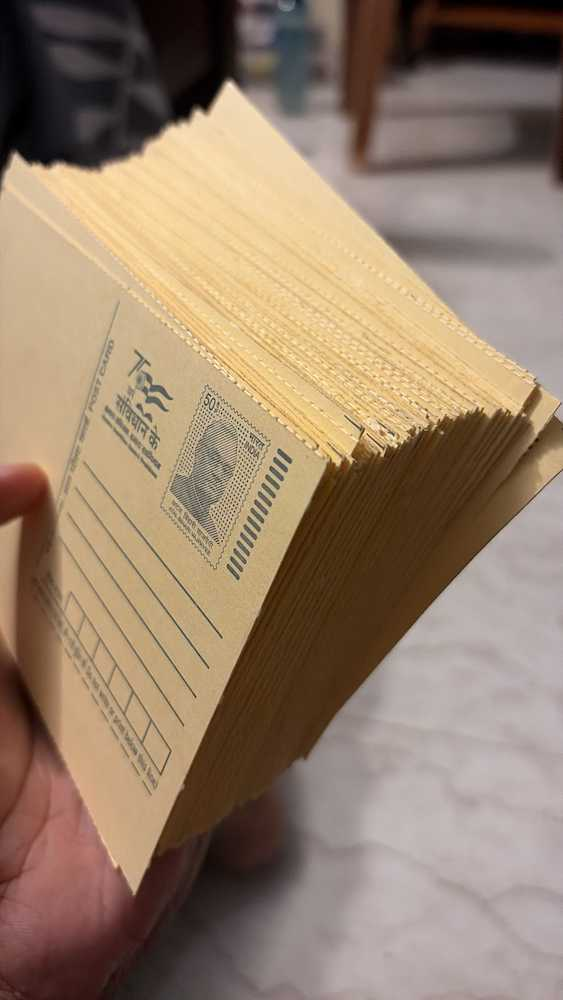
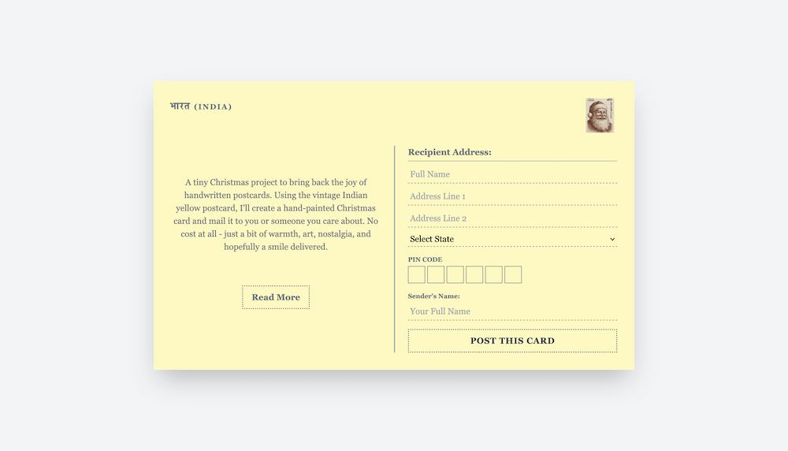
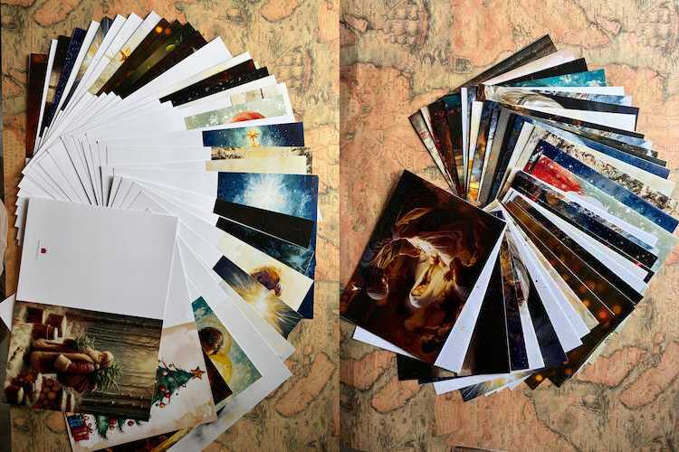
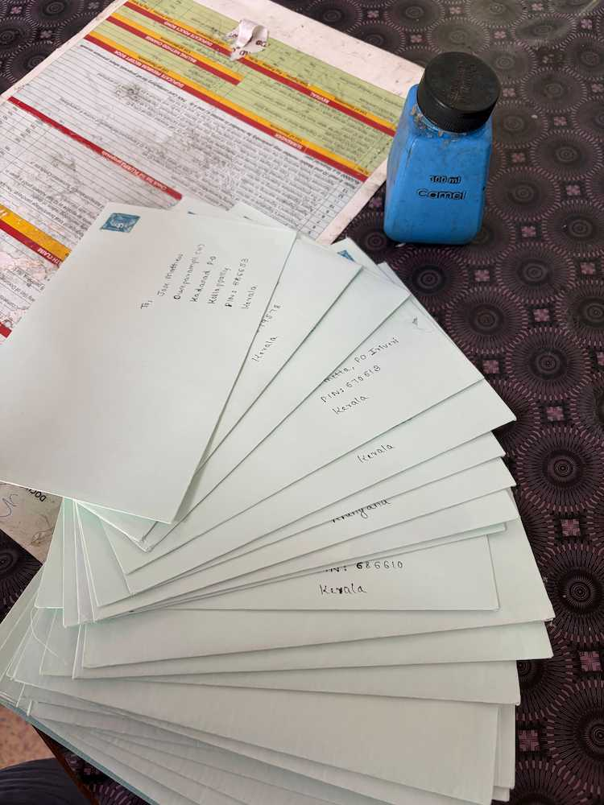

## TL;DR 

To celebrate Christmas, I hand-painted and mailed personalized postcards using vintage yellow postcards and printed custom Christmas cards for anyone who signed up through a simple web form. Without any promotion beyond a WhatsApp status, the project received over 50 requests from across India, proving that small acts of happiness can create meaningful connections.

## Memorable Christmas Season

Christmas has always been special to me. The misty weather, fireflies, colorful Christmas trees, and Christmas cribs have always made this season feel magical. Every year, I like to build or create something different. Last year, I built [a custom 4-foot Christmas star that anyone could program using JavaScript](/blog/merry-pixels-a-hand-crafted-programmable-christmas-star/). This year, I wanted to create something people could enjoy on a more personal level.

For years, I have enjoyed making and sending handmade Christmas cards and small gifts to the people closest to me. Every time, this simple process of drafting, painting, writing, and mailing something by hand brings me a kind of joy that digital messages never can. This past Christmas, I wanted to take that feeling a little further by sharing it with more people and reminding them of the joy of receiving something handwritten.

The idea was simple: collect addresses from people interested in receiving a card through an online form and send them personalized postcards.

## The Birth of Worth a Smile

For a long time, I had the idea of creating a space to share the things I make. That is how [Worth a Smile](https://www.worthasmile.in) was born. While I have not created much under this project yet, I plan to invest more time and effort into it in the future.

It is a small passion project built on a simple belief: small, thoughtful gestures often have the greatest impact. While the long-term vision includes handmade gifts and custom hampers, the purpose of the project is much simpler - to spread a little happiness.

  

For the first Christmas project, I chose the classic Indian yellow postcard. Many of us remember seeing them as children, or perhaps receiving one in the mail. There was always something special about finding a postcard in the mailbox and feeling connected to the person who sent it. That memory stayed with me, and I wanted to bring a small part of it back. So I decided to hand-paint every postcard and send it to anyone interested.

## Collecting addresses and making postcards

  

To collect addresses, I created a simple form in [Worth A Smile Xmas](https://www.worthasmile.in/xmas) where people could submit their postal details.

**Data Privacy:** Submitted addresses were stored securely in a private Notion database accessible only to me. All address data was permanently deleted after the postcards were successfully delivered.

**Tech Stack:** The project used a lightweight setup consisting of an HTML and Tailwind CSS frontend, a Deno backend powered by Deno KV, and a private Notion database for storing submissions.

**Timeline:** Postcards were dispatched during the second week of December, with delivery expected by the third week, ideally before Christmas.

  

Along with the postcards, I also designed custom Christmas cards with personalized cover artwork. For example, my wife has a Dachshund in her home, so the card I sent to her featured an illustration of her dog, which I created with the help of ChatGPT.

  <iframe width="315" height="560" src="https://youtube.com/embed/xkazSoaohnE" title="YouTube video player" frameborder="0"></iframe>

This was never meant to be a polished corporate project. It was personal. It was handmade. It was a small attempt to bring back the joy of simple and meaningful gestures.

## The Response

By the end of the project, I received more than 50 postcard requests from different parts of India. What surprised me most was that I never actively promoted it. The only place I shared it was on a single WhatsApp status. Yet requests started arriving from people I had never met.

  

To me, that was the most rewarding part of the project. Getting postcard requests from complete strangers and sending them a small piece of art made the entire effort worthwhile.

Because sometimes, the smallest things - a brushstroke, a stamp, or a few kind words - are all it takes to make life Worth a Smile.
