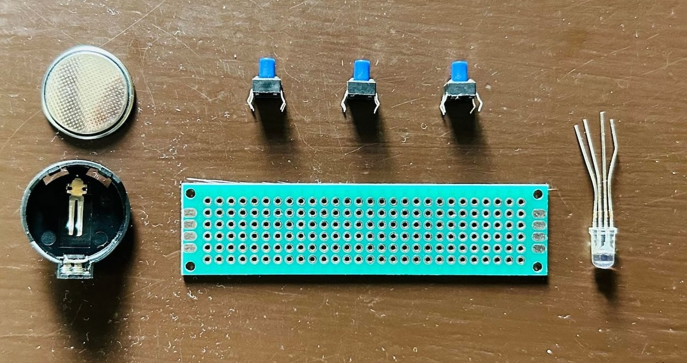
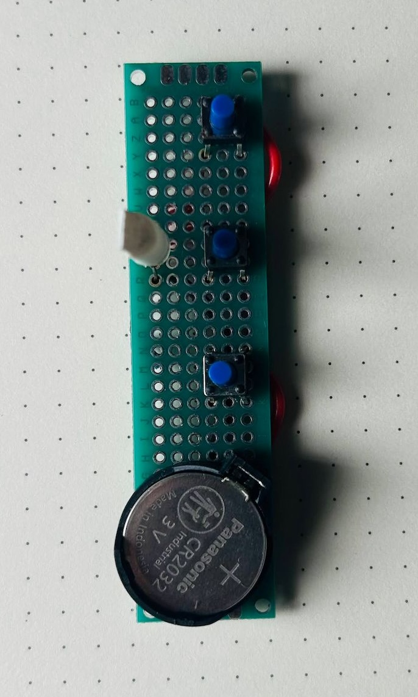
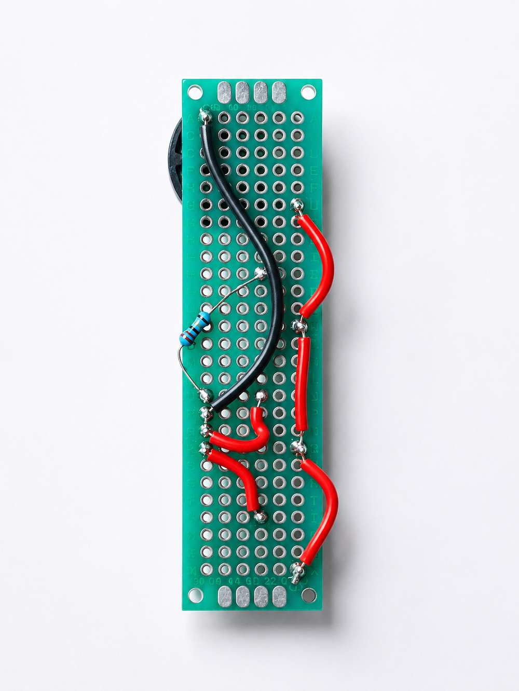

A few months ago, I mailed a small courier to my nephew, Jithu.

Inside was a simple electronics project: A circuit with an RGB LED, three push buttons, a CR2032 battery, a resistor, and a short letter explaining how it all worked.

The circuit was very simple. Press one button and the LED lights up red. Press another and it turns green. Press the third and it becomes blue. Press two buttons at the same time and the colors mix to make new colors.

I wasn't trying to teach electronics in a formal way. I didn't explain Ohm's Law. I just wanted to give him something that might make him curious—a small circuit that reacts when he presses the buttons and makes him wonder how it works.

These days, a lot of learning happens on screens. That's why getting a small handmade project in the mail still feels special.

Heres the letter:

Hi Jithuu,

Eda mone! 
I’m excited to share some cool stuff and teach you the basics of electronics. To make this activity even more fun, I’ve included a circuit with a battery, some switches and colorful LED. Let’s dive in and discover how all these pieces work together to create something magical.

Before getting into the circuit, let’s understand some basic components and concepts about electronics, such as batteries, LEDs, volt, switches, and more.

Battery is a tiny powerhouse, you already know that. This little gadget stores energy and supplies it to the electronic components, kind of like how a water pump sends water through pipes. The battery has two ends or terminals: a positive one marked with a plus sign (+) and a negative one marked with a minus sign (-). Think of the positive terminal as the starting point of a river and the negative terminal as the end where the water returns. The strength of this flow is called voltage, measured in volts (V). A typical AA or AAA battery used in remote controls and toys will have 1.5 volts each. The battery I've added in the circuit is called cr2032, which is basically a 3v battery in a coin form factor. 

Now, let’s talk about the electric river itself. This flow of electric charge is called current, measured in amperes (A). And when we talk about how much work this flow can do, like lighting up an LED, we call it power, measured in watts (W). Power is like the combination of how fast the river is flowing (current) and how steep the river is (voltage).

A switch is like the gatekeeper of our electric river. When the switch is close (pressed / turned ON), it allows the current to flow through the circuit, just like opening a gate to let water through. When the switch is open (or turned OFF), it stops the current, like closing the gate to stop the water. The switches I used in the circuit is called tactile push button switch. The circuit is closed when the button is pushed and circuit will be open when its not pushed.

Next, let’s explore the main component of our circuit: the LED, which stands for Light Emitting Diode. An LED is a special kind of light bulb that lights up when electricity flows through it. It’s much more efficient than regular bulbs because it uses less energy and lasts longer. Regular LEDs have two legs: a longer one called the anode (positive) and a shorter one called the cathode (negative). Remember, the anode is where the current enters, and the cathode is where it exits.

For this experiment, I’ve attached a special LED which has 3 colors(red, green, blue) in it. This is called a RGB LED. As the name suggests, the RGB LED is basically a combination of Red, Green, and Blue LEDs. These are the three primary colors of light. By mixing them in different amounts, we can create almost any color. For example, mixing red and green makes yellow, red and blue make magenta, and green and blue make cyan. And when you mix all three red, green, and blue you get white light! 1st button in the circuit will light up red, send will light up green and third one is for blue. Press each one individually and in combination to see how colors blend together to create different colors.

If you flip the circuit, you can see that I've connected the battery positive terminal to one leg of each of the switches, the other leg of the switch is connected to the legs of LED. For this particular LED, the negative terminal is common for all the colors, so battery negative terminal is connected to that. You can also see a component called resister in it, that is to reduce the voltage to the red color led.

Now, think about the screens on TVs and mobile phones. They use thousands of tiny RGB LEDs to create images. Each tiny dot on the screen is called a pixel, made up of tiny RGB LED. By adjusting the brightness of these lights, different colors appear, forming the pictures we see. The sharpness of these images is measured in pixels per inch (PPI), which tells us how many of these tiny dots fit in an inch of the screen. If you have a magnifier, put that above your mobile screen or tv screen and you will see these pixels. Or you can take a closeup photo of your tv screen or mobile screen and then zoom in it to see the pixels.

I hope you have fun exploring the world of electronics. Remember, always be safe and have fun experimenting. If you have any questions or discoveries, I’m just a letter away!

Love,
Jaaja

Feel free to [Download the letter](./teaching-basic-electronics-through-letter.pdf) if you want to.
