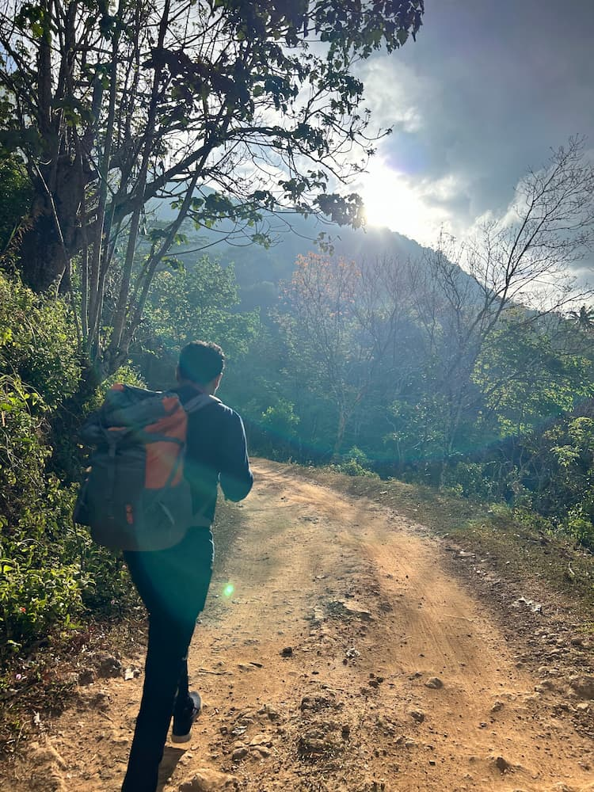
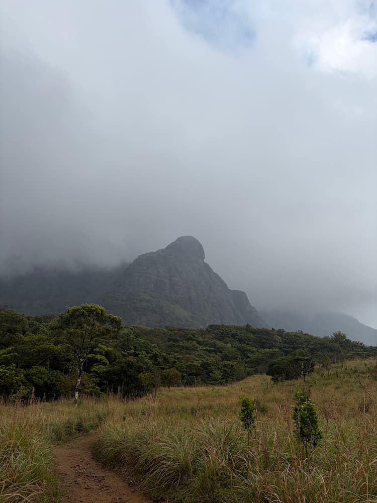
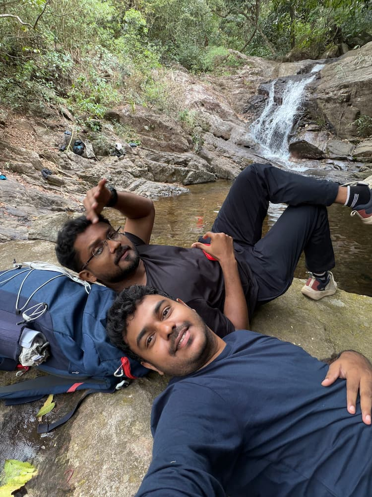
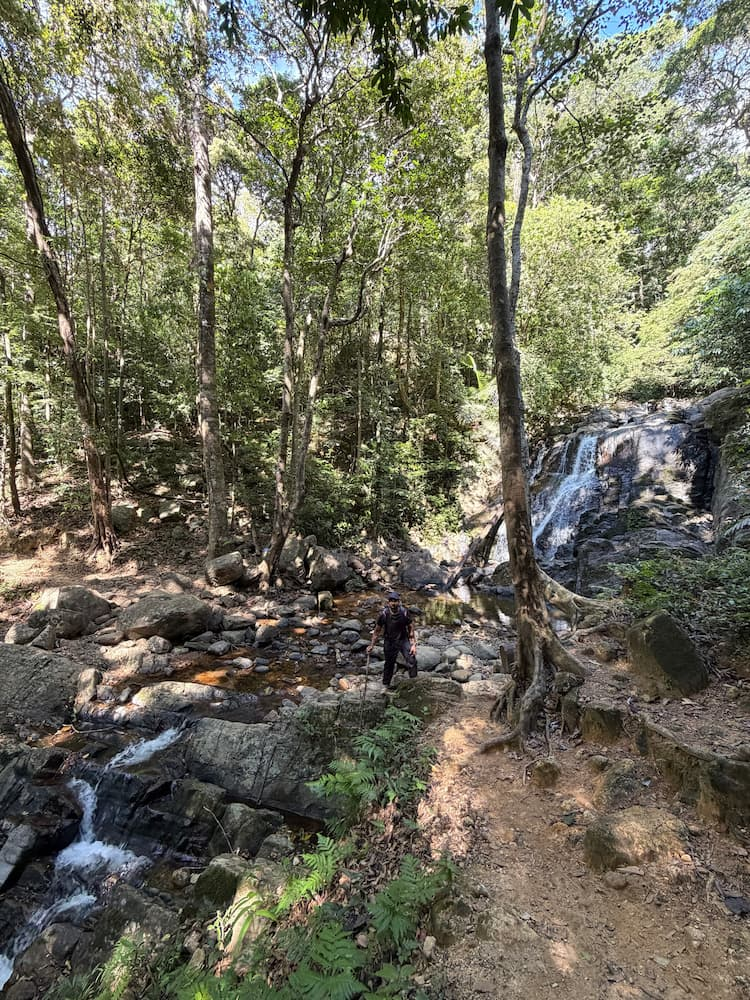
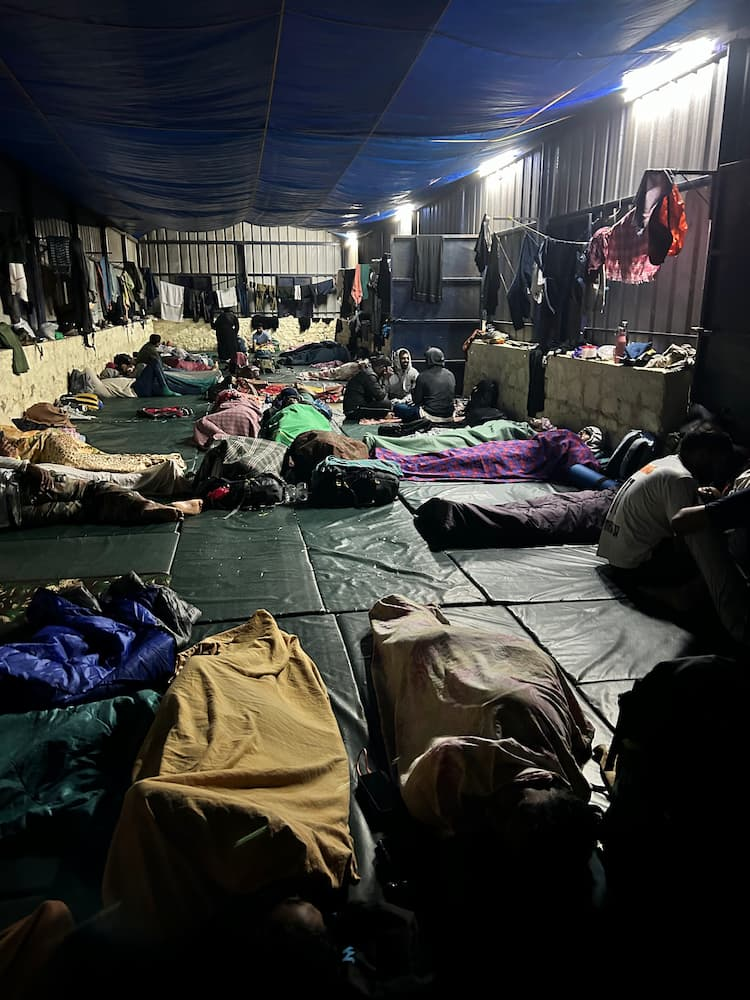

---   
title: Trekking to Agasthyarkoodam – A random plan that turned into a lifetime experience
date: 2026-01-30
description: "A randomly planned trek to Agasthyarkoodam that turned into a challenging and unforgettable journey through forest, wind, and rain."
tags:
  - trek
  - forest
  - nature
---
## Booking the Ticket and Preparation

I went trekking to Agasthyarkoodam with my friend <a href="https://www.instagram.com/nithin_cs/" target="_blank" rel="noopener noreferrer">Nithin</a>. The plan actually started very randomly. One day in January 2026, during a casual conversation, we decided to try booking tickets. There was no serious planning behind it. We just checked some random dates, tried a few times, and surprisingly, we got the ticket. That was it.

After booking, there was almost no preparation at all. I walked everyday atleast 5 KM from just 1 week before the trip. Apart from that we didn't train, didn't research much, and didn't buy fancy gear. The only things we bought were a head cap and a trekking stick. That's it. Apart from that, we carried some dry fruits and a few apples/bananas. Looking back, it sounds crazy, considering what we were about to do.

## About Agasthyarkoodam Trekking Program

Agasthyarkoodam trekking is a 3-day trekking program organized by the Kerala Forest Department. It is considered one of the hardest and longest treks in South India, covering nearly 50 kilometers in total, including steep climbs and descents.

- Day 1: Trek from the picket station to the base camp at Athirumala (around 16 km). We stay overnight at the Athirumala base camp.
- Day 2: Trek from the base camp to the Agasthyarkoodam peak and return back to the base camp.
- Day 3: Trek back from the base camp to the picket station.

Some people complete the trek in just 2 days by directly trekking down from Agasthyarkoodam to the picket station on Day 2 itself.

The trek starts from a place called Bonacaud, which is around 54 kilometers from Trivandrum town.

## Day 1

We reached Trivandrum by train and stayed there the previous day because there are only a few buses available to Bonacaud. Early in the morning, at 5:00 AM, we boarded a KSRTC bus from the Trivandrum bus stand. By 7:00 AM, we reached Bonacaud. The bus was completely packed with trekkers, which itself felt exciting.

From Bonacaud, we had to walk about 2 kilometers to reach the forest station. On the way, we had a light breakfast. Before starting the trek, we had to submit our entry pass, medical certificate, and affidavit. Our bags were also inspected carefully to make sure we weren't carrying plastic or anything harmful to the forest.

After all the checks, we were finally allowed to start trekking.

For every 10 people, one guide is assigned. But that doesn't mean the guide stays with you throughout the trek. In our case, we were mostly alone in the forest for long stretches.

We started trekking from the forest station at 9:50 AM.

### About the Trek

The trek had a mix of terrains and changing climate. In the morning, while climbing up, it was quite sunny. As we reached almost halfway, the weather became cooler, with mist and light drizzle here and there.

On the way to the Athirumala base camp, there are many waterfalls. We drank water directly from them, it was crystal clear and incredibly fresh.

By 5:00 PM, we reached the base camp. We had a small evening snack and black coffee from the canteen and then settled inside the shed. By then, my entire body was aching. I wasn't used to trekking, and with zero preparation, the pain was expected. After some light stretching and rest, we went for a bath in a nearby stream. The water was ice-cold, flowing directly from a waterfall.

When we reached the base camp, the climate was completely different from what we experienced inside the forest. There were strong winds, and it felt extremely cold. The stay was a temporary shed, similar to a dormitory. There is no electricity, and everything runs on solar power. The stored solar power is used only for basic lighting, and after 9:00 PM, all lights are switched off to save energy.

The air quality there is unbelievably good, no pollution at all. Because of that, the sky was extremely clear. The base camp has around 10 water taps, with fresh water flowing throughout the day, supplied directly from a waterfall through pipes.

Everyone must report to the camp, and no one is allowed to step outside after 6:00 PM due to the presence of wild animals like elephants and bears. We even spotted a few snakes inside the camp compound. There is a small area near the camp where mobile network is available for a few providers, but inside the camp, there is no signal at all.

That night, around 11:00 PM, a bear came very close to the dormitory. It was a terrifying experience. We could hear it roaring loudly. The bear had come to eat food waste from the canteen area. There were strong winds and continuous rainfall throughout the night. I was awake until almost 3:00 AM, unable to sleep properly.

## Day 2

We woke up early at 5:00 AM, freshened up, and had a cup of black coffee from the canteen. It was still raining. After some stretching and packing our bags, we had breakfast and started trekking towards Agasthyarkoodam by 8:00 AM.

The path to Agasthyarkoodam was even more difficult than Day 1. The elevation was steep, there was no proper straight path, and the trail was full of mud and stones. By 9:30 AM, we reached Pongalapara.

Beyond that point, no one was allowed to trek further due to the harsh weather conditions. The wind was extremely strong at the top. It was difficult even to stand still on the rocks because of the force of the wind. We waited for about 30 minutes, hoping the weather would improve, but it didn't.

So we made the tough decision to turn back.

We couldn't trek the last 3 kilometers to the peak because of the weather. Since we still had enough time, we decided to trek all the way down to the picket station on the same day. Trekking down was comparatively easier than climbing up. By 5:00 PM, we reached the picket station.

## Experience

Overall, the trek was an amazing experience, despite the physical exhaustion and body pain. It pushed my limits and taught me a lot about endurance and nature.

I would strongly recommend this trek to anyone who truly loves forests, mountains, and raw nature. It's not easy, but it's absolutely worth experiencing at least once in a lifetime.