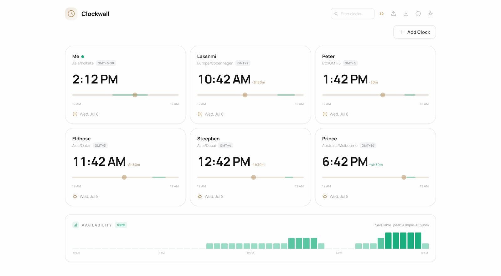

Clockwall is a simple web app that helps you keep track of time across different timezones. Add your teammates, friends, or family, set their working hours, and see at a glance who's available right now. Drag a time slider to find the perfect meeting slot that works for everyone — no more mental timezone math.

## Features

### Clock Cards
Each team member gets their own card showing real-time local time, date, timezone abbreviation, and a relative offset from your timezone.

### Time Scrubber
Drag the slider on any card to scrub forward or backward through the day. All other cards sync automatically, showing what the time would be everywhere at that moment. A "Reset" button snaps back to live time.

### Availability Tracking
Set custom working hours per person using dual-range sliders (start/end). Cards show a green indicator dot when the person is currently within their available window. The availability band is visualised directly on the slider track.

### Availability Overview
A live bar chart shows at a glance how many team members are available at each minute of the day. Hover any bar to see the exact time and who's online — perfect for finding meeting sweet spots.

### Search & Filter
Filter clocks in real time by label or timezone. A mobile-specific search input ensures the same functionality on small screens.

### Import / Export
Export your full clock configuration (labels, timezones, availability, settings) as a JSON file. Import it later or share with your team.

### 12h / 24h Toggle
Switch between 12-hour and 24-hour time formats with one click. The setting persists across sessions.

### Dark Mode
Automatic dark mode with a manual toggle. The UI adapts with carefully chosen colours for both themes — warm brass accents on mist/ink backgrounds.

### Persistent Storage
All clocks, availability settings, and preferences are saved to `localStorage`. Your layout survives page refreshes and browser restarts.

---

## Use Cases

### Remote Teams
Know exactly what time it is for each team member across London, New York, Tokyo, and Sydney. Set working hours for each person and instantly see when the team overlaps.

### Freelancers & Consultants
Track billable hours across clients in different timezones. Never miss a client call because you misjudged their local time.

### Globetrotters
Keep a wall of clocks for family and friends back home while you travel. Stay connected without asking "what time is it there?".

### Event Planning
Skim through the day to find the best meeting window across 5+ timezones. The availability overview makes it visual and immediate.

### Operations & On-Call
Monitor which team members are in their working hours across global offices. Know at a glance who's available for incidents or support.
