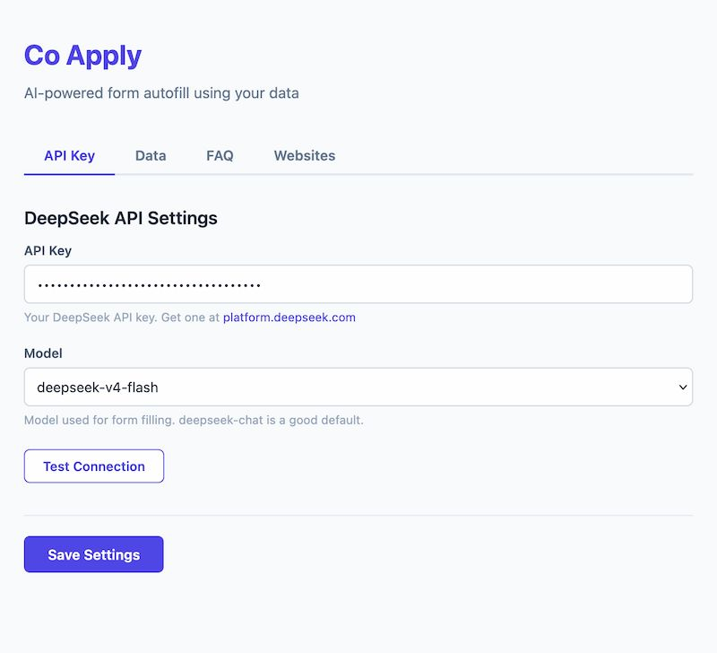

AI-powered browser extension that intelligently fills forms on any website using your data and a knowledge base powered by DeepSeek.

Built for Firefox (Manifest V3).

---

## How it works

1. Configure your data, FAQ entries, and API key in the extension settings.
2. Open any page with a form. A floating "Auto Fill" button appears.
3. Click the button. Co Apply extracts all form fields, sends them to DeepSeek along with your data, and fills the form.
4. Review each field -- green badges mark filled fields, orange badges mark fields left empty. Submit manually.

---

## Screenshots

    <figure>
        
        <figcaption class="text-xs text-zinc-500 dark:text-zinc-400 mt-1 text-center">User data and FAQ configuration</figcaption>
    </figure>
    <figure>
        
        <figcaption class="text-xs text-zinc-500 dark:text-zinc-400 mt-1 text-center">API key and model settings</figcaption>
    </figure>
    <figure>
        
        <figcaption class="text-xs text-zinc-500 dark:text-zinc-400 mt-1 text-center">Form fields filled with verification badges</figcaption>
    </figure>

---

## Features

- **Broad form detection** -- works with inputs, textareas, selects, radio buttons, checkboxes, contentEditable elements, and ARIA widgets, even outside `<form>` tags.
- **AI field understanding** -- DeepSeek interprets labels, placeholders, ARIA attributes, and nearby text to match fields to your data.
- **User data** -- store any information you commonly use (name, contact, experience, preferences, etc.) in freeform text.
- **FAQ / Knowledge base** -- reusable answers for open-ended questions like "Tell us about yourself".
- **File attachments** -- attach files (CV, certificates, etc.) for upload fields. File contents stay local, only names and descriptions are shared with the AI.
- **Verification badges** -- numbered green/orange badges persist on each field after filling so you can review before submitting.
- **Website allowlist** -- restrict the extension to specific domains, or leave empty to enable everywhere.

---

## Getting started

1. Install the extension in Firefox.
2. Open the settings page and enter your [DeepSeek API key](https://platform.deepseek.com/api_keys).
3. Add your data under the **Data** tab -- include anything you'd want filled into forms.
4. Optionally add FAQ entries and attach files.
5. Configure the extension to allowlist the website you want to use it on.
6. Navigate to any website(configured in the extension settings) with a form and click the "Auto Fill" button.

---

## Requirements

- Firefox 115 or later
- A DeepSeek API key
