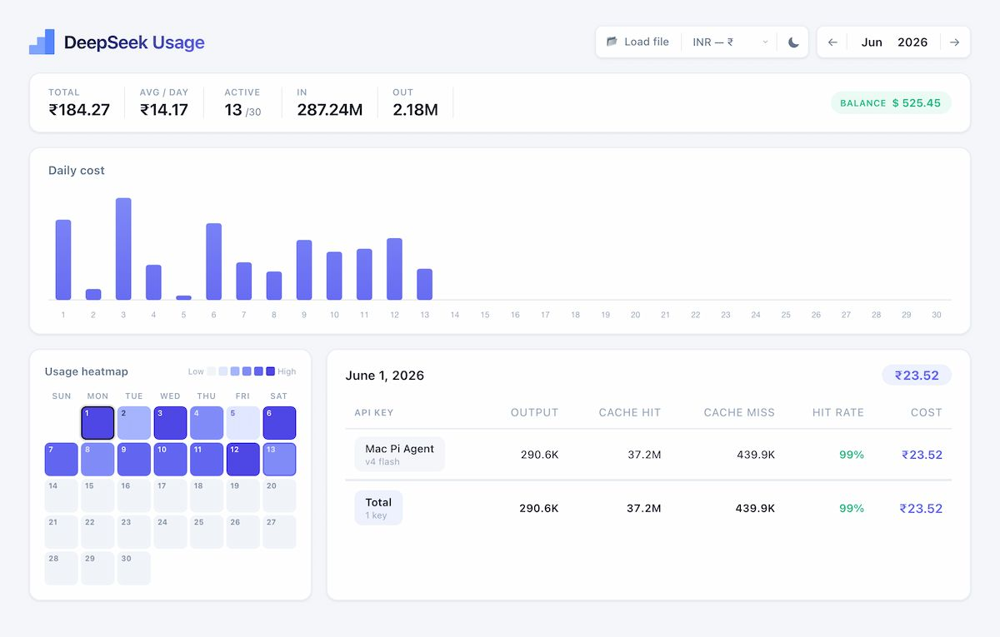
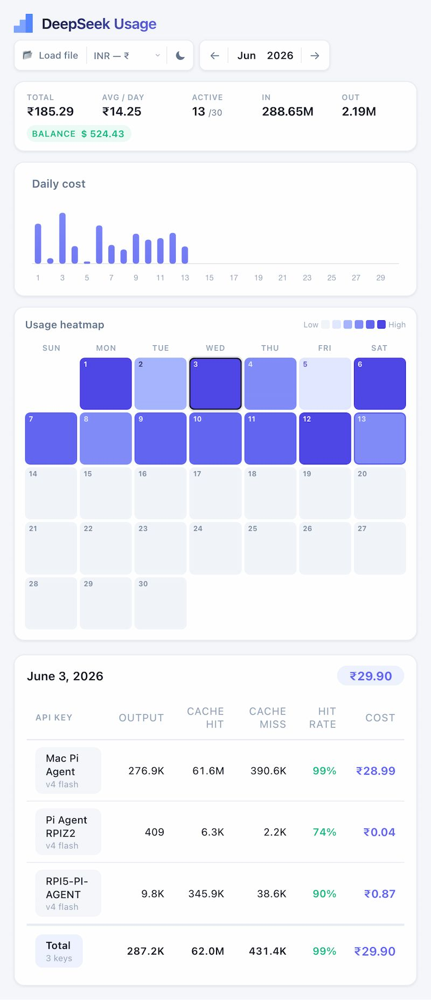

A self-hosted dashboard that pulls your DeepSeek AI usage data from the [Platform API](https://platform.deepseek.com) and renders it entirely in the browser - daily costs, token consumption, cache efficiency, and per-key breakdowns, all at a glance.

## Features

- **Daily cost & token usage** — see how many tokens you're using (input, output, cached) and what it costs, day by day.
- **Cache hit rate tracking** — monitor how effectively your prompts hit the context cache.
- **Per-API-key breakdown** — compare usage across multiple API keys.
- **Drag & drop CSV import** — upload exported CSV files directly in the browser (works offline).
- **Live data from DeepSeek** — the backend proxies the DeepSeek API so you never expose your bearer token to the frontend.
- **Static HTML dashboard** — no build step, no framework, no JavaScript bundler. Just open and go.

## Prerequisites

- [Node.js](https://nodejs.org/) 18 or later
- A DeepSeek API bearer token from [platform.deepseek.com/api_keys](https://platform.deepseek.com/api_keys)
- `unzip` on your system (macOS / Linux — available by default)

