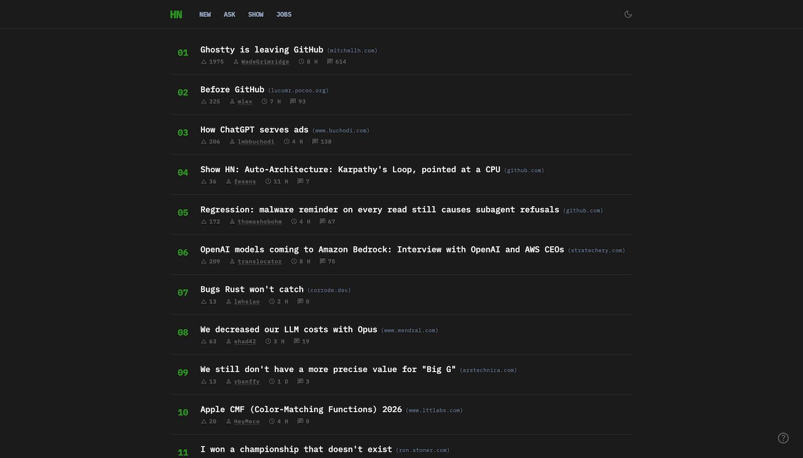
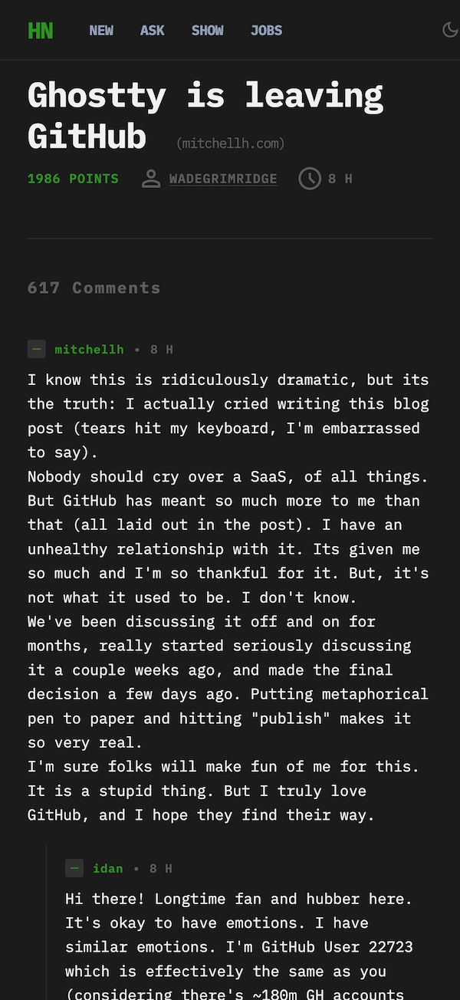

A clean, distraction-free viewer for Hacker News focused on readability, speed, and keyboard-first navigation. This is a read-only experience - no login, no submissions, no noise. Just better consumption.

## Features

* **Ample Spacing** : Clean, uncluttered layout designed for long reading sessions.
* **Dark Mode** : Carefully tuned for comfort - not just inverted colors.
* **Collapsible Comments** : Collapse entire threads to reduce noise and focus on what matters.
* **Keyboard Navigation** : Navigate like a pro - fast, efficient, and distraction-free.
    

## Why this exists

The original Hacker News is powerful, but this project explores how far we can improve the experience without changing the core product ideologies.

## Future Ideas

* Focus mode for discussions
* Inline link previews
* Highlight new comments
* Density toggle (compact vs comfortable)
