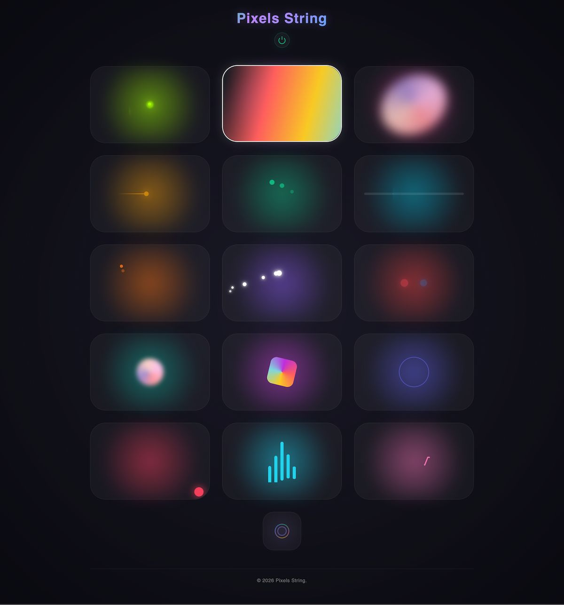

A WiFi-enabled ESP32 LED neopixel string controller with 15 stunning effects, 5 variations per effect, a physical button interface, and an embedded web dashboard for browser-based control.



## Features

- **15 LED Effects** - Fireflies, Rainbow Swipe, Aurora, Comet, Chasing Dots, Cylon, Dual Comet, Sparkle Sweep, Police, Plasma, Rainbow Gradient, Pulse Wave, Single Runner, Audio Visualizer, Heartbeat
- **5 Variations Per Effect** - Cycle through variations with successive taps on the same button
- **Web Dashboard** - Embedded HTML/CSS/JS dashboard served directly from the ESP32, with animated icons and API feedback
- **Physical Button** - Single-click to cycle effects, double-click for variations, long-press for power on/off
- **REST API** - Full programmatic control over HTTP
- **Static IP & mDNS** - Reliable network configuration with custom hostname
- **Persistent LED Count** - Number of LEDs is stored in NVS (non-volatile storage) and configurable via API
- **Auto-reconnect** - Monitors WiFi and reconnects automatically

## Hardware Requirements

- ESP32 development board
- NeoPixel-compatible LED strip (WS2812B, SK6812, etc.)
- 3.3V-5V level shifter (recommended for longer strips)
- Physical button (optional, GPIO 9 with internal pull-up)
- 5V power supply (sized for your LED count)

### Pin Connections

| Component | GPIO Pin |
|-----------|----------|
| LED Strip Data | GPIO 2 |
| Button (optional) | GPIO 9 (INPUT_PULLUP) |

## Getting Started

### 1. Clone and Configure

```bash
git clone https://github.com/shajanjp/pixels-string.git
cd pixels-string
```

### 2. WiFi & Network Config

Copy the example config and fill in your network details:

```bash
cp config.example.h config.h
```

Edit `config.h`:

```cpp
#define WIFI_SSID       "your-ssid"
#define WIFI_PASSWORD   "your-password"

#define STATIC_IP       IPAddress(192, 168, 1, 55)
#define GATEWAY         IPAddress(192, 168, 1, 1)
#define SUBNET          IPAddress(255, 255, 255, 0)

#define MDNS_HOSTNAME   "neopixel"
#define DASHBOARD_URL   "http://shajanjacob.com/pixels-string?ip=192.168.1.55"
```

> `config.h` is gitignored - your credentials stay out of version control.

### 3. (Optional) Modify the Dashboard

Edit `index.html`, then regenerate the embedded header:

```bash
npm install
node html-to-header.js
```

This minifies the HTML, CSS, and JS, and produces `dashboard_html.h` which is compiled into the firmware.

### 4. Upload to ESP32

Open `pixels-string.ino` in the Arduino IDE or VS Code with PlatformIO, select your ESP32 board, and upload.

### 5. Find Your Device

- Check your router's DHCP client list for the static IP you configured
- Or use mDNS: `http://neopixel.local`

## Web Dashboard

The ESP32 serves a full-featured dashboard at its root URL. Each effect is shown as a card with an animated icon:

- **Click a card** to activate that effect
- **Click the same card again** to cycle through its 5 variations (a toast notification shows the variation number)
- The active effect is highlighted with a glowing border


## REST API

All endpoints are served on port 80.

### `GET /api/effect?name=<name>`

Set the active effect by name.

**Valid names:**

FIREFLIES, RAINBOW_SWIPE, AURORA, COMET, CHASING_DOTS, CYLON, DUAL_COMET, SPARKLE_SWEEP, POLICE, PLASMA, RAINBOW_GRADIENT, PULSE_WAVE, SINGLE_RUNNER, AUDIO_VISUALIZER, HEARTBEAT

```
GET /api/effect?name=AURORA
```

### `GET /api/effect?index=<0-14>`

Set effect by numeric index.

```
GET /api/effect?index=2    → Aurora
```

### `GET /api/variation?index=<0-4>`

Set the variation of the current effect.

```
GET /api/variation?index=2
```

### `GET /api/power?state=<on|off>`

Turn LEDs on or off.

```
GET /api/power?state=off
```

### `GET /api/info`

Returns a JSON object with the current state.

```json
{
  "effect": "AURORA",
  "effectIndex": 2,
  "variation": 2,
  "variationMax": 4,
  "power": "on",
  "numEffects": 15,
  "ledCount": 50
}
```

### `GET /api/ledcount?count=<1-300>`

Set the number of LEDs. This is saved to NVS and persists across reboots.

```
GET /api/ledcount?count=100
```

### `GET /api/ledcount`

Returns the current LED count as JSON.

```json
{ "ledCount": 100 }
```

### `GET /help`

Plain-text listing of all available endpoints.

### `GET /api/pixels/set`

Set pixel colors with customizable patterns. All parameters are passed as query strings.

**Query Parameters**

| Parameter | Required | Description |
|-----------|----------|-------------|
| `pattern` | **Yes** | Lighting pattern: `solid`, `striped`, or `gradient`. |
| `color` | **Yes*** | Hex color code(s) without `#`. Can be repeated for multiple colors. |
| `brightness` | No | Global brightness `0–255` (default: `255`). Applied after pattern generation. |

*At least one `color` is always required.

**Color Format**
- 6-digit hex: `RRGGBB` (e.g. `FF0000` for red).
- Optionally allows 3-digit shorthand: `F00` -> `FF0000`.
- Case insensitive (`ff0000` == `FF0000`).
- Multiple colors are supplied by repeating the `color` key.

**Examples**

```
GET /api/pixels/set?pattern=solid&color=FF0000

GET /api/pixels/set?pattern=striped&color=FF0000&color=00FF00&color=0000FF

GET /api/pixels/set?pattern=gradient&color=FF0000&color=0000FF&brightness=128
```

## Effects & Variations

| # | Effect | Variations |
|---|--------|------------|
| 0 | **FIREFLIES** | 1 / 2 / 3 / 5 / 8 fireflies (speed scales with count) |
| 1 | **RAINBOW_SWIPE** | Forward / Reverse / Fast / Slow / Medium+Forward |
| 2 | **AURORA** | Blue-green / Warm / Cool violet / Pink-green / Rainbow-tinted |
| 3 | **COMET** | Position-hue / Fixed hue / Time-hue / White / Rainbow tail |
| 4 | **CHASING_DOTS** | 2 / 3 / 4 / 5 / 6 chasers |
| 5 | **CYLON** | Hue shift at ends / Hue shift + / Time-hue / White / Red |
| 6 | **DUAL_COMET** | White flash / Rainbow flash / Color-ring flash / Yellow / Red flash |
| 7 | **SPARKLE_SWEEP** | Density and width combos (5 variations) |
| 8 | **POLICE** | Alternating / Split halves / Three-segment / All flash / Sweeping |
| 9 | **PLASMA** | 2 / 3 / 4 / 5 / 5 blobs (wider) |
| 10 | **RAINBOW_GRADIENT** | Window size 6 / 10 / 14 / 18 / 22 |
| 11 | **PULSE_WAVE** | Sigma & speed combinations (5 variations) |
| 12 | **SINGLE_RUNNER** | Random hue / Rainbow-position / Time-hue / White / Tail trail |
| 13 | **AUDIO_VISUALIZER** | Simulated spectrum analyzers with varying band counts & styles |
| 14 | **HEARTBEAT** | Mac breathing / Lub-dub center / Alternating side / Travelling / Dual pulse |

## Physical Button Controls

| Action | Result |
|--------|--------|
| **Single click** | Cycle to the next effect |
| **Double click** | Cycle variation (0 → 1 → 2 → 3 → 4 → 0) |
| **Long press (2s)** | Toggle power on/off |

## Project Structure

```
pixels-string/
├── pixels-string.ino      # Main Arduino sketch (effects, WiFi, HTTP, button)
├── config.example.h       # WiFi & network config template
├── config.h               # Your actual config (gitignored)
├── index.html             # Web dashboard source (HTML/CSS/JS)
├── dashboard_html.h       # Auto-generated: minified HTML embedded as a C string
├── html-to-header.js      # Node.js script to minify HTML & generate header
├── package.json           # Node dependencies (html-minifier)
└── pixels-string-dashboard-screenshot.jpg
```

## Maximum LEDs

The software limit is 300 LEDs (`MAX_LEDS`). Adjust this in `pixels-string.ino` if your hardware supports fewer or more (within ESP32 memory constraints).
