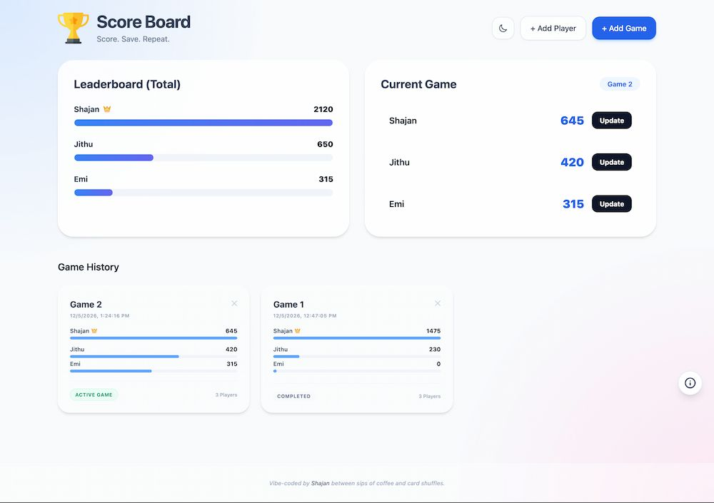

Score Board is a simple, elegant, and mobile-friendly web application designed to track scores for card games, board games, or any friendly competition. With a focus on speed and aesthetic, it features a modern glassmorphism UI, real-time leaderboard updates, and persistent game history.

## 🚀 Features

-   **Glassmorphism UI**: A modern, clean, and interactive design.
-   **Dark Mode Support**: Automatically respects system preferences or can be toggled manually.
-   **Real-time Leaderboard**: Visualizes total scores across all games with dynamic progress bars.
-   **Active Game Tracking**: Easily update scores for the current game.
-   **Game History**: Keep track of previous games, players, and final scores.
-   **Player Management**: Add and remove players easily.
-   **Local Persistence**: All data is stored locally in your browser using LocalStorage—no backend required.
-   **Responsive Design**: Works great on desktops, tablets, and smartphones.

## 🛠️ Built With

-   **HTML5**: Semantic structure.
-   **Tailwind CSS**: Modern utility-first styling.
-   **Vanilla JavaScript**: Lightweight and fast logic without external dependencies.
-   **LocalStorage**: Persistent client-side data storage.

## 📖 How to Use

1.  **Add Players**: Click the "+ Add Player" button to register the names of your friends.
2.  **Start a Game**: Click "+ Add Game", give it a name, and select the players participating.
3.  **Update Scores**: In the "Current Game" section, click "Update" next to a player's name to add points or replace their current score.
4.  **View History**: Scroll down to see the "Game History" cards for all previous sessions.
5.  **Toggle Theme**: Use the theme toggle in the header to switch between Light and Dark modes.
