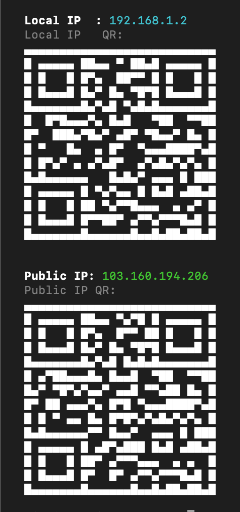

Display local and public IP addresses in the terminal, with optional QR codes, clipboard copy, JSON output, and watch mode.



## Install

```bash
npm install -g seemyip
```

Requires [Node.js](https://nodejs.org) 18 or later.

## Quick start

```bash
# Run without installing
npx seemyip

# Show public IP with QR code and copy to clipboard
npx seemyip -gqc
```

## Usage

```
seemyip [options]
```

### Display

| Flag | Description |
|------|-------------|
| `-l`, `--local` | Show local IP only |
| `-g`, `--global` | Show public IP only |
| `-q`, `--qr` | Show QR codes for the IPs |
| `-6`, `--ipv6` | Include IPv6 addresses |
| `-j`, `--json` | Machine-readable JSON output |
| `-n`, `--no-color` | Disable colored output |

### Actions

| Flag | Description |
|------|-------------|
| `-c`, `--copy` | Copy IP address(es) to clipboard |
| `-o`, `--open` | Open IP in default browser |
| `-w`, `--watch [s]` | Watch for IP changes every N seconds (default: 5) |

### General

| Flag | Description |
|------|-------------|
| `-v`, `--version` | Print version number |
| `-h`, `--help` | Show help |

## Examples

```bash
# Show both local and public IP
seemyip

# Show only public IP with QR code
seemyip -gq

# JSON output for scripting
seemyip -j

# Show both IPs, copy to clipboard
seemyip -c

# Watch for changes every 5 seconds
seemyip -w

# Watch every 10 seconds, only public IP
seemyip -w 10 -g

# Show local IPv6 address
seemyip -6 -l

# Quiet, no-color output (safe for piping)
seemyip -n
```

## How it works

- **Local IP** -- Uses `os.networkInterfaces()` to find the first non-internal IPv4 address. With `-6`, prefers a routable IPv6 address.
- **Public IP** -- Queries these services in order, first to respond wins:
  1. `api.ipify.org`
  2. `icanhazip.com`
  3. `checkip.amazonaws.com`
- **QR codes** -- Generated in-terminal as scannable `http://<ip>` URLs.
- **Clipboard** -- Uses `pbcopy` (macOS), `wl-copy`/`xclip` (Linux), or `clip` (Windows).
- **Watch mode** -- Polls at the given interval and highlights changes in yellow.

## Requirements

- Node.js 18+ (uses built-in `fetch`)
- Terminal with Unicode support (for QR codes)

## License

MIT
